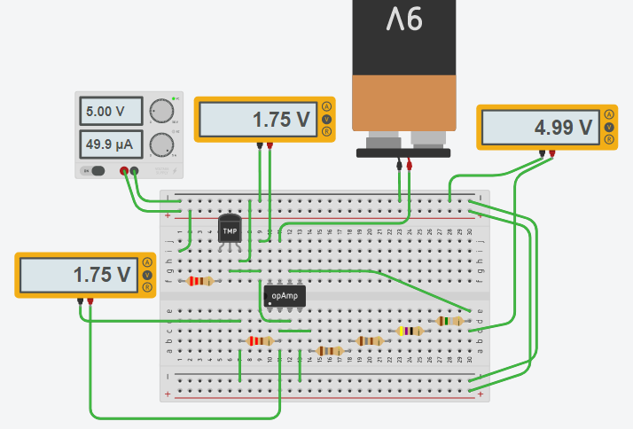
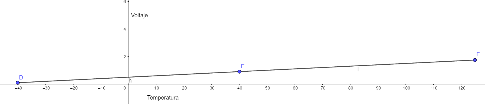
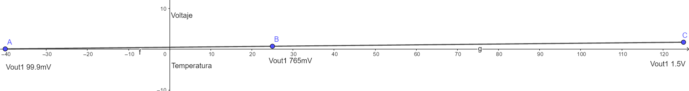
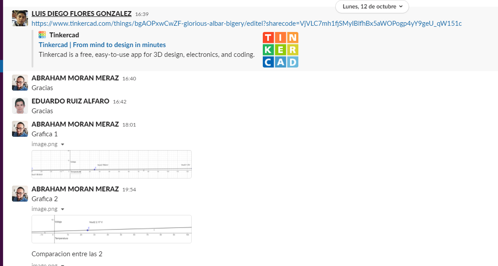
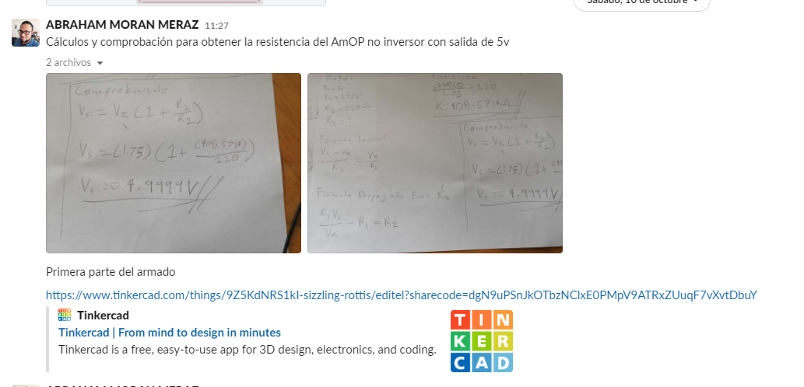
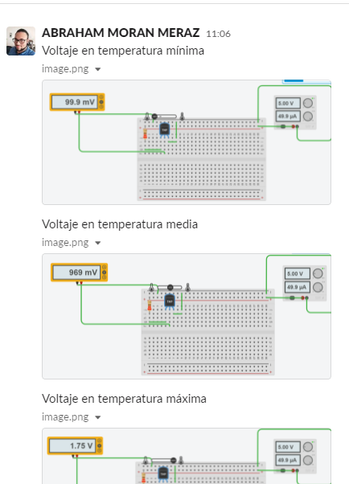

# Sensores

## :trophy: A.1.4 Actividad de aprendizaje

## Objetivo

Realizar un sensor medidor de temperatura a través de un circuito electrónico, utilizando un simulador, y un **Transistor TMP36** lineal de temperatura y un **amplificador operacional LM741**.

## :blue_book: Instrucciones

- Se sugiere para el desarrollado de la presenta actividad, utilice uno de los siguientes simuladores: [Autodesk Tinkercad](https://www.tinkercad.com/), [Virtual BreadBoard](http://www.virtualbreadboard.com/), [Easy EDA](https://easyeda.com/) por lo cual habrá que familiarizarse antes, e incluso instalarse o registrarse dentro de la plataforma.
- Toda actividad o reto se deberá realizar utilizando el estilo **MarkDown con extension .md** y el entorno de desarrollo VSCode, debiendo ser elaborado como un documento **single page**, es decir si el documento cuanta con imágenes, enlaces o cualquier documento externo debe ser accedido desde etiquetas y enlaces, y debe ser nombrado con la nomenclatura **A1.4_NombreApellido_Equipo.pdf.**
- Es requisito que el .md contenga una etiqueta del enlace al repositorio de su documento en GITHUB, por ejemplo **Enlace a mi GitHub** y al concluir el reto se deberá subir a github.
- Desde el archivo **.md** exporte un archivo **.pdf** que deberá subirse a classroom dentro de su apartado correspondiente, sirviendo como evidencia de su entrega, ya que siendo la plataforma **oficial** aquí se recibirá la calificación de su actividad.
- Considerando que el archivo .PDF, el cual fue obtenido desde archivo .MD, ambos deben ser idénticos.
- Su repositorio ademas de que debe contar con un archivo **readme**.md dentro de su directorio raíz, con la información como datos del estudiante, equipo de trabajo, materia, carrera, datos del asesor, e incluso logotipo o imágenes, debe tener un apartado de contenidos o indice, los cuales realmente son ligas o **enlaces a sus documentos .md**, _evite utilizar texto_ para indicar enlaces internos o externo.
- Se propone una estructura tal como esta indicada abajo, sin embargo puede utilizarse cualquier otra que le apoye para organizar su repositorio.

```
- readme.md
  - blog
    - C0.1_x.md
    - C0.2_x.md
  - img
  - docs
    - A0.1_x.md
    - A0.2_x.md
    - A1.2_x.md
    - A1.3_x.md
```

## :pencil2: Desarrollo

1. Utilice el siguiente listado de materiales para la elaboración de la actividad

   | Cantidad | Descripción                       | Fuente de consulta                                                                                                   |
   | -------- | --------------------------------- | -------------------------------------------------------------------------------------------------------------------- |
   | 1        | Sensor temperatura TMP36          | [Components101.com](https://components101.com/sites/default/files/component_pin/TMP36-Sensor-Pinout.png)             |
   | 1        | Potenciómetro 10k                 | [Components101.com](https://components101.com/sites/default/files/component_datasheet/potentiometer%20datasheet.pdf) |
   | 2        | Resistencias de 220               | [Steren](https://www.steren.com.mx/resistencia-de-carbon-de-1-2-watt-al-5-de-tolerancia-de-220-ohms.html)            |
   | 1        | Amplificador LM741                | [AllDatasheet](https://pdf1.alldatasheet.com/datasheet-pdf/view/9027/NSC/LM741.html)                                 |
   | 1        | Fuente de alimentación de 5Volts. | [ShopDelta](https://shopdelta.eu/pdf.php?page=shop/instruction&product_id=7952)                                      |

   Para mayor información acceder a los siguientes enlaces:

   - Información y especificaciones del [Sensor TMP36](https://components101.com/sites/default/files/component_pin/TMP36-Sensor-Pinout.png)
   - Información y especificaciones del [Amplificador operacional LM741](https://ortegamraul.files.wordpress.com/2014/03/741-interno.png)

2. Basado en la imagen ensamble mediante un simulador el circuito electrónico etapa 1, colocando el transistor LM35 en la posición indicada.

<p align="center">
    
</p>

3. Calcule, mida y registre los valores solicitados para Vout1, bajos las 3 condiciones requeridas en la tabla anexa.

| Numero | Condición | Voltaje Vout1 medido | Voltaje en R1 medido | Temperatura indicada |
| ------ | --------- | -------------------- | -------------------- | -------------------- |
| 1      | Mínima    | 99.9 mV              | 11 mV                | -40 °C               |
| 2      | Media     | 909 mV               | 11 mV                | 40 °C                |
| 3      | Máxima    | 1.75 V               | 11 mV                | 125 °C               |

4. Utilizando la imagen del transistor TMP36 que corresponde a la etapa 1, conecte la terminal Vout1 a la terminal no inversora del LM741, y ensamble el circuito correspondiente a la etapa 2.

<p align="center">
    

## </p>

<p align="center">
    

</p>

5. **Que valor deberá tener R3 en el circuito Etapa 2, para lograr obtener Vout2 = 5 volts,** para la condición máxima de temperatura que el sensor es capaz de detectar? Como se puede observar la resistencia R3 corresponde a un potenciómetro, sin embargo se pueden hacer arreglos de resistencias para lograr un ajuste fino. Cual cree que sea la razón por la cual se esta solicitando un **ajuste a 5 Volts**?

   Formula:

   Vs = Ve(1+(R2/R1))

   Formula despejada:

   ((Vs / Ve) - 1) \* R1 = R2

   ((5v / 1.75v) - 1) \* 220ohm = 408.5 ohm

   Resistencia: 408.5 ohm

   Arreglo de resistencias comerciales en serie:

   180 ohm + 180 ohm + 47 ohm + 1.5 ohm = 408.5 ohm

   Comprobar:

   Vs = Ve(1+(R2/R1))

   Vs = 1.75V(1+(408.5ohm/220ohm))


   Es para ampliar el rango que se podria detectar utilizando algun dispositivo digital, como ejemplo si utilizaramos un microrontrolador es mas exacta la varicacion de temperatura de 0 a 5 Volts para hacer una relacion con la temperatura de -40 a 125 que si solo utilizamos la escala original de 0 a 1.75 V.
   

6. Una vez que se ha ajustado el valor R3 dejalo asi y registre los valores solicitados para Vout2, para las 3 condiciones requeridas en la tabla anexa.

| Numero | Condición        | Voltaje en R2 medido | Voltaje en Vout2 medido | Temperatura indicada |
| ------ | ---------------- | -------------------- | ----------------------- | -------------------- |
| 1      | Condición mínima | 99.9 mV              | 286 mV                  | -40 °C               |
| 2      | Condición media  | 909 mV               | 2.60 V                  | 40 °C                |
| 3      | Condición máxima | 1.75 V               | 4.99 V                  | 125 °C               |

7. Grafique Vout1 y Vout2, para las tres condiciones anteriores, considerando en "X" los valores de temperatura y para "Y" los valores de voltaje, y coloque dentro de este apartado.

<p align="center">
    
</p>

<p align="center">
    
</p>

<p align="center">
    
</p>

8. Conclusiones

Eduardo Ruiz: Una práctica para entender cómo funcionaba un sensor de movimiento, en específico el nombre de PIR HC-SR501, conociendo su funcionamiento interno, características y algunas de sus aplicaciones en el mundo. Entendiendo que utiliza la radiación infrarroja del ser vivo para aplicar una acción.

Diego Flores: En la práctica se pudo entender el funcionamiento detrás de los típicos sensores de movimiento, ahora comprendiendo que estos detectan los cambio de radiación infrarroja que emiten los cuerpos que emiten calor. Esto permitiendo detectar anomalías en el entorno a monitorizar y poder tomar algún tipo de acción en particular.

Abraham Moran: El sensor que PIR HC-SR501 es muy interesante por su funcionamiento, trabaja con la radiación electromagnética infrarroja lo que le permite detectar los objetos y personas que pasan en alcance y que emiten este tipo de radiación. Durante el desarrollo e investigación de nuestra exposición nos relacionamos más con el entendimiento de las hojas de datos además de entender mejor el funcionamiento de este tipo de sensores que comparten algunas de sus características con otros vistos en clase.

9. Evidencias
   <p align="center">
    
</p>
   <p align="center">
    
</p>
   <p align="center">
    
</p>
   <p align="center">
    
</p>

---

### :bomb: Rubrica

| Criterios     | Descripción                                                                                 | Puntaje |
| ------------- | ------------------------------------------------------------------------------------------- | ------- |
| Instrucciones | Se cumple con cada uno de los puntos indicados dentro del apartado Instrucciones?           | 10      |
| Desarrollo    | Se respondió a cada uno de los puntos solicitados dentro del desarrollo de la actividad?    | 60      |
| Demostración  | El alumno se presenta durante la explicación de la funcionalidad de la actividad?           | 20      |
| Conclusiones  | Se incluye una opinión personal de la actividad por cada uno de los integrantes del equipo? | 10      |

# :open_file_folder: [>>>Enlace a mi GitHub: Diego Flores<<<](https://github.com/Diego-FloresG/Sistemas_Programables_Practicas) :open_file_folder:

# :open_file_folder: [>>>Enlace a mi GitHub: Abraham Moran<<<](https://github.com/AbrahamMoranMeraz/Sistemas_Prog) :open_file_folder:

# :open_file_folder: [>>>Enlace a mi GitHub: Eduardo Ruiz<<<](https://github.com/EduardoRuiz2099/Sistemas-Programables) :open_file_folder:
