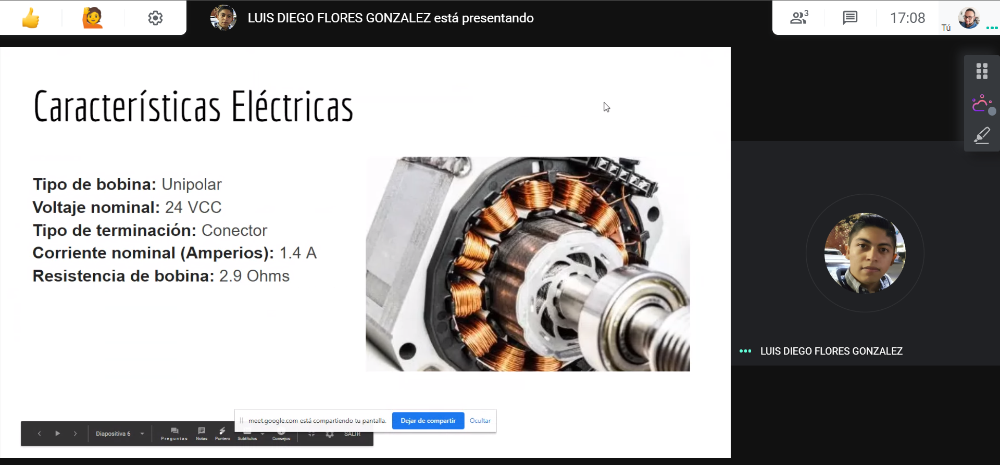
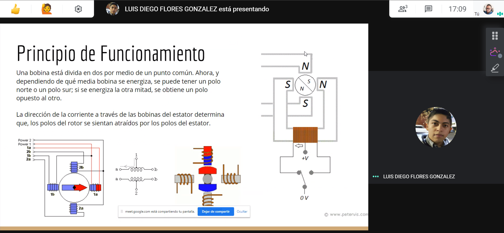
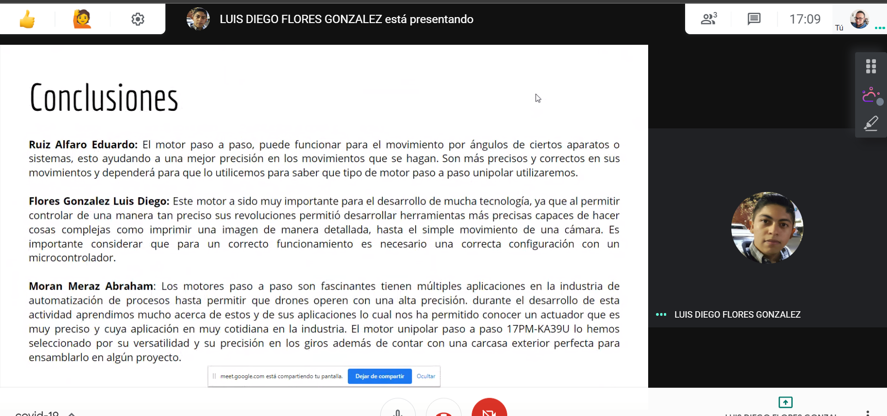

# Actuadores

## :trophy: A.2.1 Actividad de aprendizaje

**Tipos de actuadores eléctricos comerciales**

### :blue_book: Instrucciones

1. Cada equipo deberá elaborar su presentación de acuerdo con el modelo del actuador eléctrico que el asesor le indique.
2. Los temas deberán exponerse en clase por todos los integrantes evitando que se perciba la lectura del documento.
3. El tiempo máximo de la presentación deberá ser no mayor a 8 minutos.
4. La actividad será redactada utilizando el estilo **_markdown_**.
5. El documento deberá incluir, los elementos indicados en la **rubrica** tales como son portada, introducción, desarrollo, conclusiones e información bibliográfica o enlaces utilizados.
6. El desarrollo deberá incluir características físicas y eléctricas, esquemático, usos aplicativos, imágenes del actuador, asi como cualquier otra información que considere importante y que le pueda apoyar en el desarrollo de la exposición.
7. El documento deberá contar con la nomenclatura **A2.1_NombreApellido_Equipo**, y se deberá subir a la plataforma classroom en formato PDF dentro del apartado correspondiente a la actividad.
8. El documento elaborado para desarrollar la actividad será compartido en la plataforma colaborativa **GitHub**, dando acceso al asesor para su revisión.

### :pencil2: Desarrollo

1. Utilice el siguiente listado de modelos de actuadores electricos comerciales, para elaborar su actividad de acuerdo con las instrucciones solicitadas por el asesor.

   - [ ] [Motor reductor de doble eje](https://articulo.mercadolibre.com.mx/MLM-651722486-motor-reductor-de-doble-eje-recto-3-vcc-mot-120-_JM?quantity=1#position=3&type=item&tracking_id=36396cb4-7b75-41a3-97e3-a0c6af6709c3)
   - [x] [Motor Unipolar paso a paso](https://articulo.mercadolibre.com.mx/MLM-587352935-motor-a-pasos-pm55l-048-unipolar-75-por-paso-con-cables-_JM?quantity=1#position=3&type=item&tracking_id=1a7ba1b9-b483-4d15-889f-2b970c4779c2)
   - [ ] [Motor Bipolar paso a paso](https://articulo.mercadolibre.com.mx/MLM-783827003-motores-a-pasos-nema-23-bipolar-13kg-minebea-japones-arduino-_JM?quantity=1#position=2&type=item&tracking_id=f05c36d1-e3e0-4d19-b76e-8bbd132124fd)
   - [ ] [Servomotor modelo SG90](https://articulo.mercadolibre.com.mx/MLM-618694358-micro-servomotor-sg90-robotica-arduino-16-kg-servo-motor-_JM?quantity=1&variation=23651072471#position=1&type=item&tracking_id=4b156b79-3721-4fc1-9ef0-4f378d92e1ef)

2. Espere a que el asesor le indique que tipo de sensor sera el que desarrollara su equipo y una vez que tenga marque el sensor dentro del punto anterior.
3. Una vez que conoce el tema a desarrollar, investigue y redacte dentro de este documento los puntos siguiente:
[Presentación motor unipolar](../docs/Motor%20Unipolar%20Paso%20A%20Paso%2017PM-KA39U.pdf)
4. Inserte imágenes de **evidencias** tales como son reuniones de los integrantes del equipo realizadas para el desarrollo de la actividad

    

    

    

    

1. Incluya las conclusiones individuales y resultados observados durante el desarrollo de la actividad.

- Ruiz Alfaro Eduardo: El motor paso a paso, puede funcionar para el movimiento por ángulos de ciertos aparatos o sistemas, esto ayudando a una mejor precisión en los movimientos que se hagan. Son más precisos y correctos en sus movimientos y dependerá para que lo utilicemos para saber que tipo de motor paso a paso unipolar utilizaremos.
- Flores Gonzalez Luis Diego: Este motor a sido muy importante para el desarrollo de mucha tecnología, ya que al permitir controlar de una manera tan preciso sus revoluciones permitió desarrollar herramientas más precisas capaces de hacer cosas complejas como imprimir una imagen de manera detallada, hasta el simple movimiento de una cámara. Es importante considerar que para un correcto funcionamiento es necesario una correcta configuración con un microcontrolador.
- Moran Meraz Abraham: Los motores paso a paso son fascinantes tienen múltiples aplicaciones en la industria de automatización de procesos hasta permitir que drones operen con una alta precisión. durante el desarrollo de esta actividad aprendimos mucho acerca de estos y de sus aplicaciones lo cual nos ha permitido conocer un actuador que es muy preciso y cuya aplicación en muy cotidiana en la industria. El motor unipolar paso a paso 17PM-KA39U lo hemos seleccionado por su versatilidad y su precisión en los giros además de contar con una carcasa exterior perfecta para ensamblarlo en algún proyecto.

### :bomb: Rubrica

| Criterios     | Descripción                                                                                 | Puntaje |
| ------------- | ------------------------------------------------------------------------------------------- | ------- |
| Instrucciones | Se cumple con cada uno de los puntos indicados dentro del apartado Instrucciones?           | 10      |  | 5 |
| Desarrollo    | Se respondió a cada uno de los puntos solicitados dentro del desarrollo de la actividad?    | 60      |
| Demostración  | El alumno se presenta durante la explicación de la funcionalidad de la actividad?           | 20      |
| Conclusiones  | Se incluye una opinión personal de la actividad por cada uno de los integrantes del equipo? | 10      |

# :open_file_folder: [>>>>>Enlace a mi GitHub: Diego Flores<<<<<](https://github.com/Diego-FloresG/Sistemas_Programables_Practicas) :open_file_folder:

# :open_file_folder: [>>>>>Enlace a mi GitHub: Abraham Moran<<<<<](https://github.com/AbrahamMoranMeraz/Sistemas_Prog) :open_file_folder:

# :open_file_folder: [>>>>>Enlace a mi GitHub: Eduardo Ruiz<<<<<](https://github.com/EduardoRuiz2099/Sistemas-Programables) :open_file_folder:
