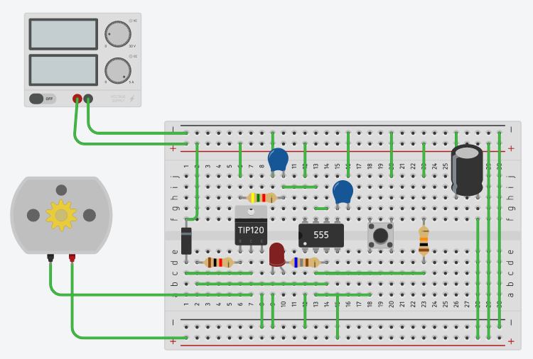
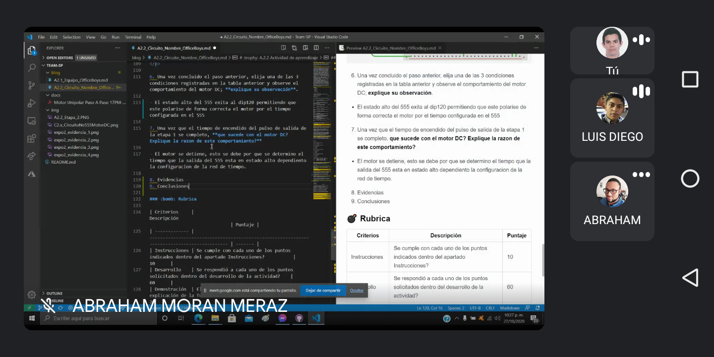
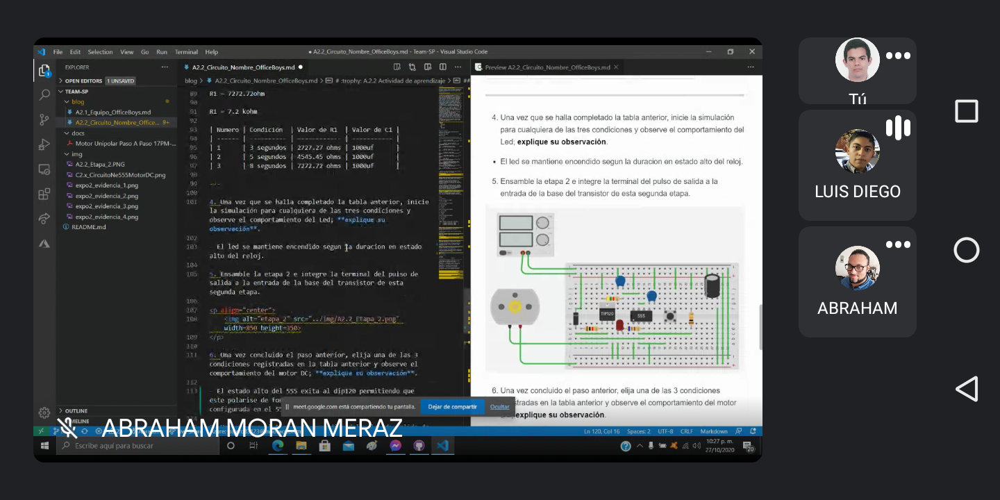
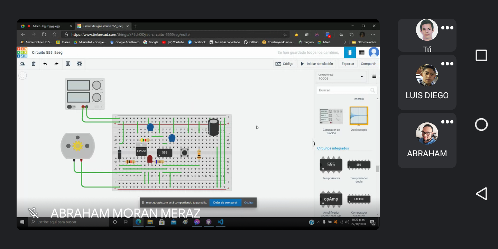
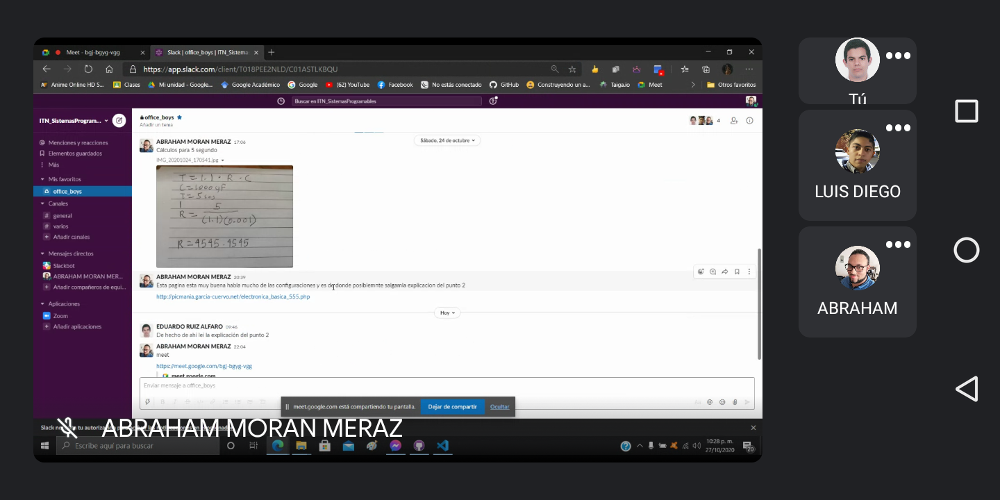

# Actuadores

# :trophy: A.2.2 Actividad de aprendizaje

Realizar un sistema de control de arranque y encendido para un actuador eléctrico a través de un circuito electrónico, utilizando un simulador, un **Temporizador NE55s** y un **Motor de DC**.

### :blue_book: Instrucciones

- Se sugiere para el desarrollado de la presenta actividad, utilice uno de los siguientes simuladores: [Autodesk Tinkercad](https://www.tinkercad.com/), [Virtual BreadBoard](http://www.virtualbreadboard.com/), [Easy EDA](https://easyeda.com/) por lo cual habrá que familiarizarse antes, e incluso instalarse o registrarse dentro de la plataforma.
- Toda actividad o reto se deberá realizar utilizando el estilo **MarkDown con extension .md** y el entorno de desarrollo VSCode, debiendo ser elaborado como un documento **single page**, es decir si el documento cuanta con imágenes, enlaces o cualquier documento externo debe ser accedido desde etiquetas y enlaces, y debe ser nombrado con la nomenclatura **A2.2_NombreApellido_Equipo.pdf.**
- Es requisito que el .md contenga una etiqueta del enlace al repositorio de su documento en GITHUB, por ejemplo **Enlace a mi GitHub** y al concluir el reto se deberá subir a github.
- Desde el archivo **.md** exporte un archivo **.pdf** que deberá subirse a classroom dentro de su apartado correspondiente, sirviendo como evidencia de su entrega, ya que siendo la plataforma **oficial** aquí se recibirá la calificación de su actividad.
- Considerando que el archivo .PDF, el cual fue obtenido desde archivo .MD, ambos deben ser idénticos.
- Su repositorio ademas de que debe contar con un archivo **readme**.md dentro de su directorio raíz, con la información como datos del estudiante, equipo de trabajo, materia, carrera, datos del asesor, e incluso logotipo o imágenes, debe tener un apartado de contenidos o indice, los cuales realmente son ligas o **enlaces a sus documentos .md**, _evite utilizar texto_ para indicar enlaces internos o externo.
- Se propone una estructura tal como esta indicada abajo, sin embargo puede utilizarse cualquier otra que le apoye para organizar su repositorio.

```
- readme.md
  - blog
    - C2.1_x.md
    - C2.2_x.md
  - img
  - docs
    - A2.1_x.md
    - A2.2_x.md
```

### :pencil2: Desarrollo

1.Utilice el siguiente listado de materiales para la elaboración de la actividad

| Cantidad | Descripción                            | Hoja de Especificaciones                                                                                                      |
| -------- | -------------------------------------- | ----------------------------------------------------------------------------------------------------------------------------- |
| 1        | Circuito integrado LM555               | [Texas Instruments](https://www.ti.com/lit/ds/symlink/lm555.pdf)                                                              |
| 1        | Capacitor electrolítico de 47uf        | [Steren](https://www.steren.com.mx/pub/media/wysiwyg/doctosMX/Capacitores_tips.pdf)                                           |
| 1        | Condensador cerámico de 10nf           | [YAGEO](https://www.farnell.com/datasheets/2167236.pdf)                                                                       |
| 1        | Fuente de voltaje de 9V                | [Energizer](http://www.farnell.com/datasheets/1744132.pdf)                                                                    |
| 1        | Transistor de poder TIP122             | [On Semiconductor](https://www.onsemi.com/pub/Collateral/TIP120-D.PDF)                                                        |
| 1        | Diodo 1N4001 o equivalente             | [On Semiconductor](https://www.onsemi.com/pub/Collateral/1N4001-D.PDF)                                                        |
| 1        | Mini Motor DC                          | [electronicoscaldas](https://www.electronicoscaldas.com/datasheet/PPN7PA12C1_NMB-Technologies.pdf)                            |
| 3        | Resistencias 680,1k,10k Ohmios de 1/4w | [Resistencias](http://www.juntadeandalucia.es/averroes/centros-tic/29009909/helvia/aula/archivos/_56/RESISTENCIAS-TABLAS.pdf) |
| 1        | Pulsador de disparo                    | [Component 101](https://components101.com/sites/default/files/component_datasheet/Push-Button.pdf])                           |
| 1        | Diodo Led Rojo                         | [Ross](https://ross.com.es/ross01/pdf-fullwat/diodos_led.pdf)                                                                 |

2. Utilice el circuito electrónico de la imagen siguiente y ensamble la etapa 1 dentro del simulador.

<p align="center">
    
</p>

3. Como se podrá observar en el circuito anterior existe un area identificada como "Red de tiempo" y otra "Filtro de desacople", **explique el proposito de ambos terminologias**.

- Red del tiempo: Esta estructura corresponde a los componentes de tiempo al tener tener valores R y C se determina el tiempo que la salida del 555 esta en estado alto. Una vez que el circuito se enciende o se activa, solo cronometrará una vez.

- Filtro de desacople: El desacoplo son útiles en muchos tipos de circuitos donde el ruido necesita ser limpiado en una fuente de alimentación de CC. En un mundo perfecto, la potencia que obtienes de una fuente de alimentación de CC, sería una señal de CC perfecta, sin ruido en ella. Sin embargo la señal es generalmente imperfecta.

4. Continuando con la imagen anterior, observe se muestra la ecuación Ct= 1.1 _ R1 _ C1, la cual es utilizada para establecer el tiempo de **encendido del pulso de salida**. Basándose en esa ecuación anterior calcule los valores de **R1 y C1** si se desea mantener encendido el pulso de salida, dada las 3 condiciones requeridas en la tabla anexa.

---

Formula:

T = 1.1 x R1 x C1

Sustituir con capacitor de 1000 uF:

T = 1.1 x R1 x 1000uF

Calcular resistencia para 3 segundos

R1 = (3s/1.1)/0.001f

R1 = 2727.27ohm

R1 = 2.7 kohm

Calcular resistencia para 5 segundos

R1 = (5s/1.1)/0.001f

R1 = 4545.45ohm

R1 = 4.5 kohm

Calcular resistencia para 8 segundos

R1 = (3s/1.1)/0.001f

R1 = 7272.72ohm

R1 = 7.2 kohm

| Numero | Condición  | Valor de R1  | Valor de C1 |
| ------ | ---------- | ------------ | ----------- |
| 1      | 3 segundos | 2727.27 ohms | 1000uf      |
| 2      | 5 segundos | 4545.45 ohms | 1000uf      |
| 3      | 8 segundos | 7272.72 ohms | 1000uf      |

---

5. Una vez que se halla completado la tabla anterior, inicie la simulación para cualquiera de las tres condiciones y observe el comportamiento del Led; **explique su observación**.

- El led se mantiene encendido segun la duracion en estado alto del reloj.

6. Ensamble la etapa 2 e integre la terminal del pulso de salida a la entrada de la base del transistor de esta segunda etapa.

<p align="center">
    
</p>

7. Una vez concluido el paso anterior, elija una de las 3 condiciones registradas en la tabla anterior y observe el comportamiento del motor DC; **explique su observación**.

- El estado alto del 555 exita al dip120 permitiendo que este polarise de forma correcta el motor por el tiempo configurada en el 555

8. Una vez que el tiempo de encendido del pulso de salida de la etapa 1 se completo, **que sucede con el motor DC? Explique la razon de este comportamiento?**

- El motor se detiene, esto se debe por que se determino el tiempo que la salida del 555 esta en estado alto dependiento la configuracion de la red de tiempo.

9. Evidencias

<p align="center">
    
</p>

<p align="center">
    
</p>

<p align="center">
    
</p>

<p align="center">
    
</p>

<p align="center">
    
</p>

<p align="center">
    
</p>

10. Conclusiones

Moran Meraz Abraham: Esta práctica me parecio muy interesante por la forma tan simple del controlador 555 pues solo requiere de ser configurado por componentes externos para aumentar o disminuir la frecuencia con la que su salida se representa en estado alto. Aprendimos a configurarlo para que su salida permanecía en estado alto con duraciones distintas y utilizando la configuración monoestable de este. El control de componentes sencillos o la activación de aquellos que requieren de más potencia o voltaje activando transistores es muy interesante en aplicaciones de proyectos futuros.

Ruiz Alfaro Eduardo: El controlador 555, es bastante interesante que con tan solo dos pequeñas cosas, puedas hacer que tu circuito cambie en como funciona, no fue la primera vez que escuche de el, pero ahora entiendo el funcionamiento de este y como poder manipularlo. A este controlador se le puede sacar mucho provecho, como para hacer semaforos, o relojes. Aprender a utilizarlo con el motor, fue un extra para captar que pasa con este controlador y con otros componentes.

Flores Gonzalez Luis Diego: En la práctica se desarrolló un circuito que incorpora un circuito integrado 555, al implementarlo se mostró como al realizar una configuración de la red de tiempo al utilizar una respectiva resistencia, así como el capacitor es posible determinar el tiempo de estado en alto del circuito para realizar una acción determinada. Para esta práctica se mostró un ejemplo básico que muestra como al implementar un correspondiente actuador o led, se puede controlar el tiempo en que este estará funcionando. Con esta actividad me demostró, que con una correcta ejecución del circuito base se puede manejar un gran número de componentes electrónicas de la manera deseada.

### :bomb: Rubrica

| Criterios     | Descripción                                                                                 | Puntaje |
| ------------- | ------------------------------------------------------------------------------------------- | ------- |
| Instrucciones | Se cumple con cada uno de los puntos indicados dentro del apartado Instrucciones?           | 10      |
| Desarrollo    | Se respondió a cada uno de los puntos solicitados dentro del desarrollo de la actividad?    | 60      |
| Demostración  | El alumno se presenta durante la explicación de la funcionalidad de la actividad?           | 20      |
| Conclusiones  | Se incluye una opinión personal de la actividad por cada uno de los integrantes del equipo? | 10      |

# :open_file_folder: [>>>>>Enlace a mi GitHub: Diego Flores<<<<<](https://github.com/Diego-FloresG/Sistemas_Programables_Practicas) :open_file_folder:

# :open_file_folder: [>>>>>Enlace a mi GitHub: Abraham Moran<<<<<](https://github.com/AbrahamMoranMeraz/Sistemas_Prog) :open_file_folder:

# :open_file_folder: [>>>>>Enlace a mi GitHub: Eduardo Ruiz<<<<<](https://github.com/EduardoRuiz2099/Sistemas-Programables) :open_file_folder:
