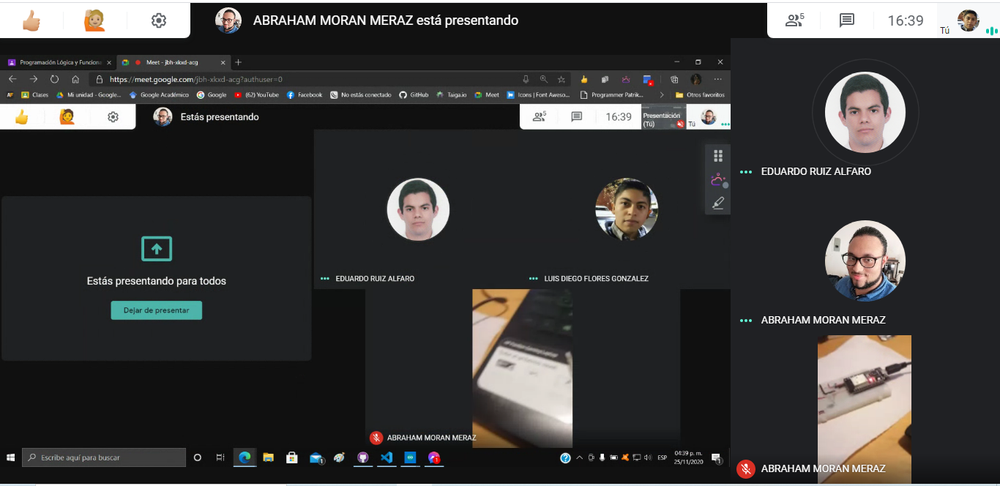
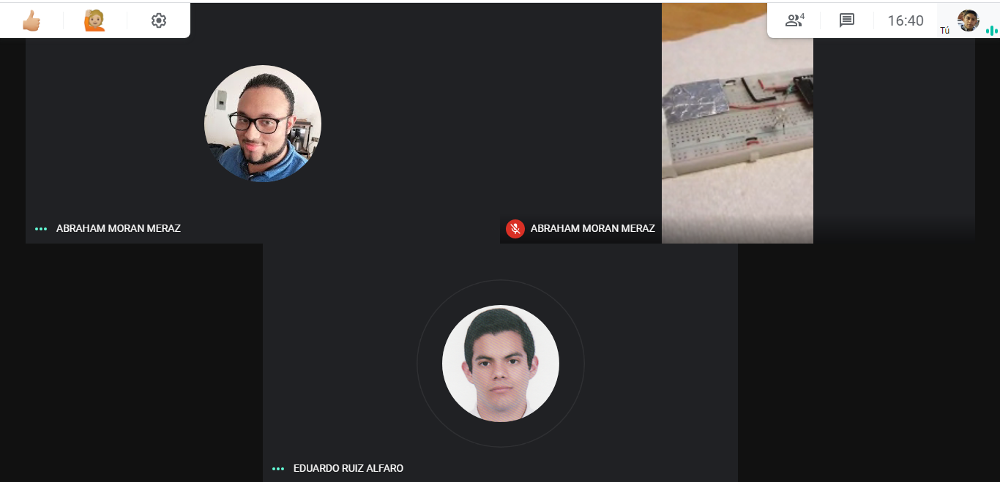
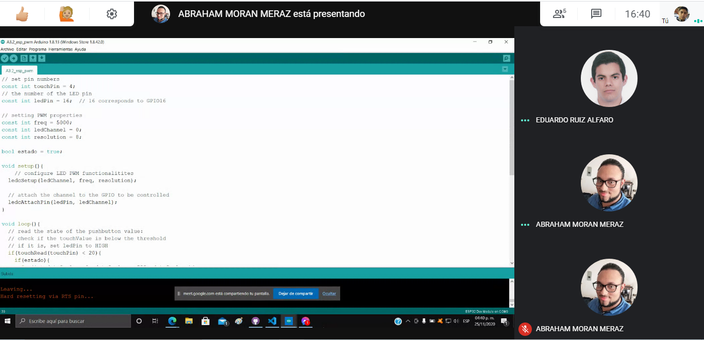
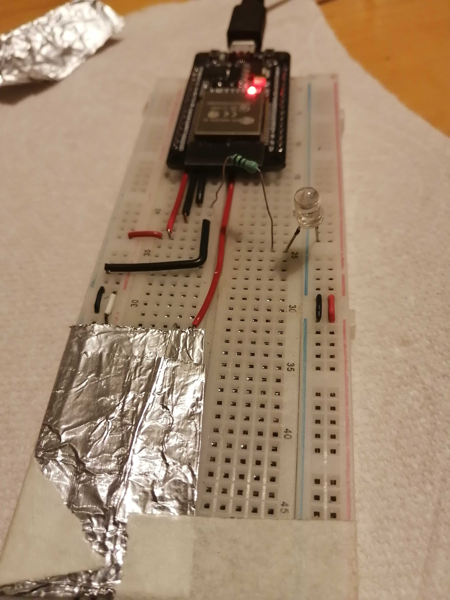
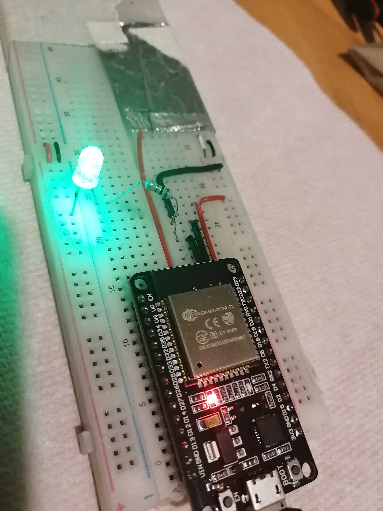
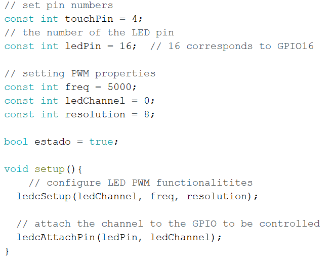
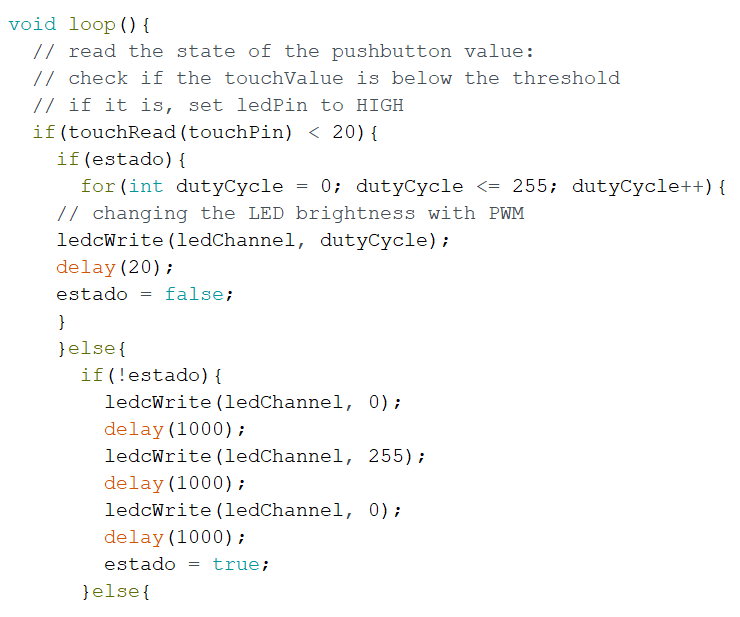

# :trophy: A.3.2 Actividad de aprendizaje

Circuito sensor de tacto a través de un NodeMCU ESP32

---

## Instrucciones

- Basado en la figura 1, ensamblar un sistema, capaz de responder al tacto, a través de un circuito electrónico, utilizando un NodeMCU **ESP32**, un **Sensor de tacto capacitivo**.
- Toda actividad o reto se deberá realizar utilizando el estilo **MarkDown con extension .md** y el entorno de desarrollo VSCode, debiendo ser elaborado como un documento **single page**, es decir si el documento cuanta con imágenes, enlaces o cualquier documento externo debe ser accedido desde etiquetas y enlaces, y debe ser nombrado con la nomenclatura **A3.2_NombreApellido_Equipo.pdf.**
- Es requisito que el .md contenga una etiqueta del enlace al repositorio de su documento en GITHUB, por ejemplo **Enlace a mi GitHub** y al concluir el reto se deberá subir a github.
- Desde el archivo **.md** exporte un archivo **.pdf** que deberá subirse a classroom dentro de su apartado correspondiente, sirviendo como evidencia de su entrega, ya que siendo la plataforma **oficial** aquí se recibirá la calificación de su actividad.
- Considerando que el archivo .PDF, el cual fue obtenido desde archivo .MD, ambos deben ser idénticos.
- Su repositorio ademas de que debe contar con un archivo **readme**.md dentro de su directorio raíz, con la información como datos del estudiante, equipo de trabajo, materia, carrera, datos del asesor, e incluso logotipo o imágenes, debe tener un apartado de contenidos o indice, los cuales realmente son ligas o **enlaces a sus documentos .md**, _evite utilizar texto_ para indicar enlaces internos o externo.
- Se propone una estructura tal como esta indicada abajo, sin embargo puede utilizarse cualquier otra que le apoye para organizar su repositorio.

```
- readme.md
  - blog
    - C3.1_TituloActividad.md
    - C3.2_TituloActividad.md
    - C3.3_TituloActividad.md
    - C3.4_TituloActividad.md
    - C3.5_TituloActividad.md
    - C3.6_TituloActividad.md
    - C3.7_TituloActividad.md
    - C3.8_TituloActividad.md
  - img
  - docs
    - A3.1_TituloActividad.md
    - A3.2_TituloActividad.md
    - A3.3_TituloActividad.md
```

---

### Fuentes de apoyo para desarrollar la actividad

- [x] [Sensor de tacto capacitivo](https://randomnerdtutorials.com/esp32-touch-pins-arduino-ide/)
- [x] [Salida analogica PWM](https://randomnerdtutorials.com/esp32-pwm-arduino-ide/)

---

## Desarrollo

1.Utilice el siguiente listado de materiales para la elaboración de la actividad

| Cantidad | Descripción                                                                                                                                                                                                                | Hoja de Especificaciones                                                                                                      |
| -------- | -------------------------------------------------------------------------------------------------------------------------------------------------------------------------------------------------------------------------- | ----------------------------------------------------------------------------------------------------------------------------- |
| 1        | Diodo led Rojo                                                                                                                                                                                                             | [Ross](https://ross.com.es/ross01/pdf-fullwat/diodos_led.pdf)                                                                 |
| 1        | Resistencia 330 ohms                                                                                                                                                                                                       | [Resistencias](http://www.juntadeandalucia.es/averroes/centros-tic/29009909/helvia/aula/archivos/_56/RESISTENCIAS-TABLAS.pdf) |
| 1        | Fuente de voltaje de 5V                                                                                                                                                                                                    | [Delta-Opti](https://shopdelta.eu/pdf.php?page=shop/instruction&product_id=7952)                                              |
| 1        | [NodeMCU ESP32](https://www.amazon.com.mx/ESP-32-ESP-32S-ESP-WROOM-32-ESP32-S-desarrollo/dp/B07TBFC75Z/ref=sr_1_2?__mk_es_MX=%C3%85M%C3%85%C5%BD%C3%95%C3%91&dchild=1&keywords=esp32&qid=1599003438&sr=8-2)                |
| 1        | [BreadBoard](https://www.amazon.com.mx/Deke-Home-Breadboard-distribuci%C3%B3n-electr%C3%B3nica/dp/B086C9HK7V/ref=sr_1_22?__mk_es_MX=%C3%85M%C3%85%C5%BD%C3%95%C3%91&dchild=1&keywords=breadboard&qid=1599003455&sr=8-22)   |
| 1        | [Jumpers M/M](https://www.amazon.com.mx/ELEGOO-Macho-Hembra-Macho-Macho-Hembra-Hembra-Protoboard/dp/B06ZXSQ5WG/ref=sr_1_1?__mk_es_MX=%C3%85M%C3%85%C5%BD%C3%95%C3%91&dchild=1&keywords=jumper+wires&qid=1599003519&sr=8-1) |
| 1        | Hoja de aluminio                                                                                                                                                                                                           |

<p align="center"> 
    <strong>Figura 1 Circuito ESP32 IC L293 Motor DC</strong>
    
</p>

2. Una vez ensamblado el circuito anterior, realice un programa que permita al ensamble cumplir con las siguientes condiciones:
   - El sistema deberá ser capaz de encender y apagar **un led** al presionar el sensor de tacto.
   - El sistema deberá tener la característica que si el Led esta encendido, al tocar el sensor de tacto, este iniciara un secuencia de intermitencia de 3 segundos (es decir se apaga 1 segundo, se enciende un segundo y se apaga finalmente).
   - El sistema deberá contar con la característica que si el Led esta apagado, al tocar el sensor de tacto, este se encenderá poco a poco hasta llegar a su nivel máximo de iluminación.
3. Coloque aquí evidencias que considere importantes durante el desarrollo de la actividad.

<p align="center"> 
    
</p>

<p align="center"> 
    
</p>

<p align="center"> 
    
</p>

<p align="center"> 
    
</p>

<p align="center"> 
    
</p>

<p align="center"> 
    
</p>

<p align="center"> 
    
</p>

4. Conclusiones

Ruiz Alfaro Eduardo: Esta actividad en equipo ya fue el segundo microcontrolador a utilizar, este que es menos conocido, si esta un poco mas complicado en utilizar una idea para poder programarlo, ya que existen muchos tutoriales, pero a la vez no todos funcionan. En la practica, se combinaron dos ejercicios que ya se habian desarrollado, el sentido touch del ESP32, donde podemos ver como funciona el sistema tactil de este mismo, y como podemos alterar los resultados con tan solo tocar un pin o GPIO. Y tambien la actividad de encender y apagar un led a cierta velocidad, este era mas facil de entender, por lo mismo que ya lo hemos hecho en Arduino, solo que esta vez era controlar el tiempo en el que se iba encendiendo y apagando. La union de estas dos estuvo interesante, y otra manera de practicar su programacion y usos de este microcontrolador.

Flores Gonzalez Luis Diego: En esta práctica se realizó un programa para prender el led de manera lenta hasta una iluminación total y cuando se apague este mostrará un parpadeo, el código para esto fue implementado relativamente fácil ya que se tenía el código de la práctica anterior. Para el desarrollo se implementó una nueva configuración para el correcto funcionamiento en el ESP32, donde se mostraron diferentes funciones para realizar la programación diferentes a cuando se trabaja con arduino, por lo mismo fue interesante observar que el propio IDE de Arduino se puede adaptar con otros microcontroladores permitiendo tener un mayor alcance con el uso de esta plataforma, fue una buena experiencia para empezar a entender el como trabajar con el ESP32 ya que nos permitio crear nuestra propia logica para resolver un problema o crear una nueva funcionalidad sobre un codigo previamente definido.

Moran Meraz Abraham: Es una practica muy interesante para nosostros pues nos permitio conocer mejor los pines que funcionan con pwm del esp32, ademas de conocer el pin tactil que este incluye. Aprendimso a configurar y utilizar este pin tactil para controlar un led que esta en pwm y ha configurarlo. Para esta practica aprendi en lo personal ha utilizar mejor el esp32 con el arduiono ide pues ya antes he realizado practicas con un arduino uno pero no con este microcontrolador, que al parecer tiene grandes capacidades tecnologicas.

---

### :bomb: Rubrica

| Criterios     | Descripción                                                                                 | Puntaje |
| ------------- | ------------------------------------------------------------------------------------------- | ------- |
| Instrucciones | Se cumple con cada uno de los puntos indicados dentro del apartado Instrucciones?           | 10      |
| Desarrollo    | Se respondió a cada uno de los puntos solicitados dentro del desarrollo de la actividad?    | 60      |
| Demostración  | El alumno se presenta durante la explicación de la funcionalidad de la actividad?           | 20      |
| Conclusiones  | Se incluye una opinión personal de la actividad por cada uno de los integrantes del equipo? | 10      |

# :open_file_folder: [>>>>>Enlace a mi GitHub: Diego Flores<<<<<](https://github.com/Diego-FloresG/Sistemas_Programables_Practicas) :open_file_folder:

# :open_file_folder: [>>>>>Enlace a mi GitHub: Abraham Moran<<<<<](https://github.com/AbrahamMoranMeraz/Sistemas_Prog) :open_file_folder:

# :open_file_folder: [>>>>>Enlace a mi GitHub: Eduardo Ruiz<<<<<](https://github.com/EduardoRuiz2099/Sistemas-Programables) :open_file_folder:
