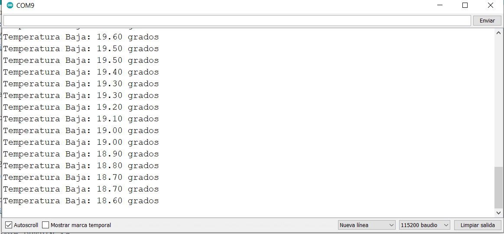
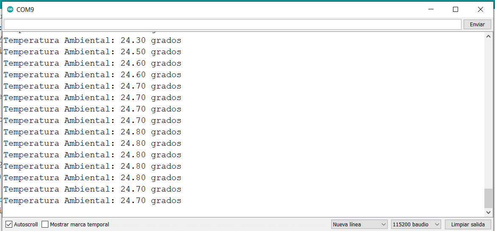
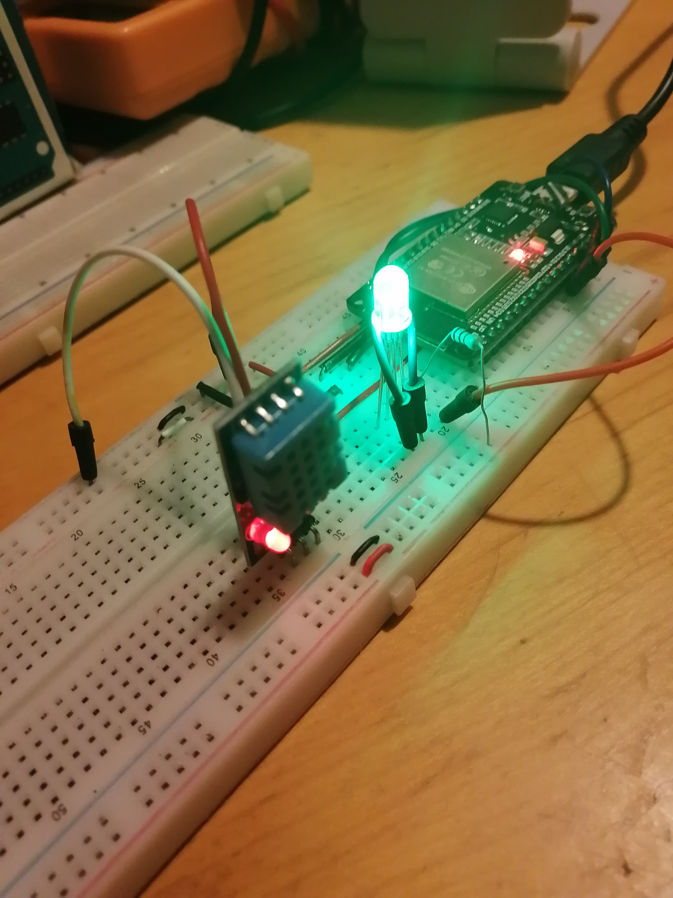
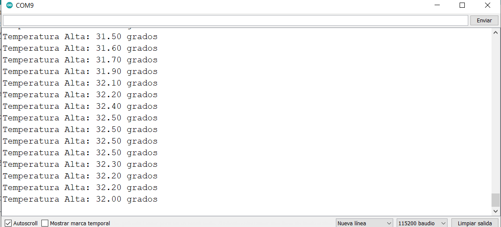
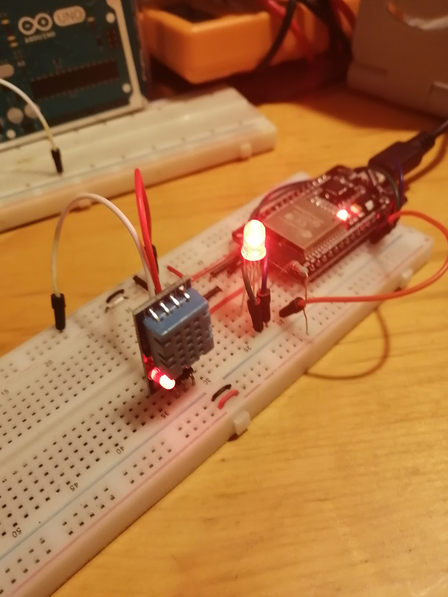
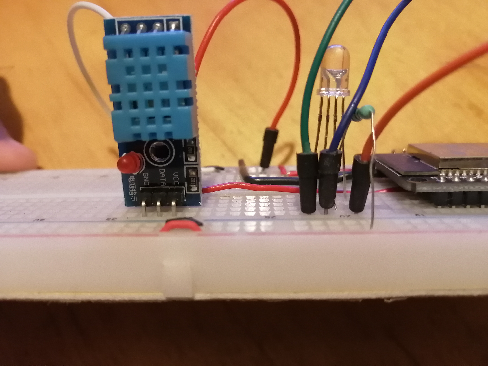
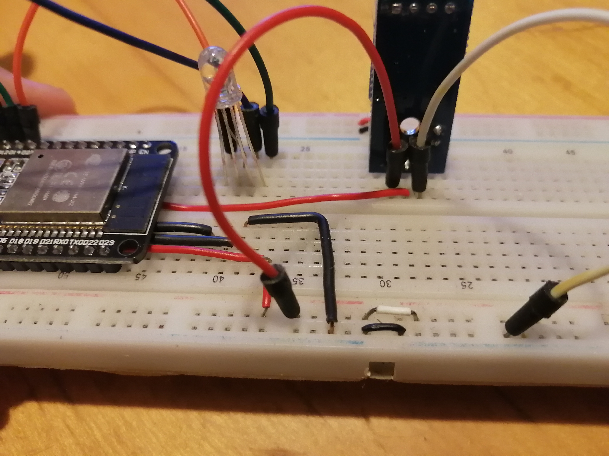

# :trophy: A.3.3 Actividad de aprendizaje

Circuito de medición de temperatura a través de un NodeMCU ESP32

---

## Instrucciones

- Basado en la figura 1, ensamblar un sistema, capaz de detectar la temperatura y humedad del ambiente, a través de un circuito electrónico, utilizando un NodeMCU **ESP32**, y un **Sensor DHT11/DHT22**.
- Toda actividad o reto se deberá realizar utilizando el estilo **MarkDown con extension .md** y el entorno de desarrollo VSCode, debiendo ser elaborado como un documento **single page**, es decir si el documento cuanta con imágenes, enlaces o cualquier documento externo debe ser accedido desde etiquetas y enlaces, y debe ser nombrado con la nomenclatura **A3.3_NombreApellido_Equipo.pdf.**
- Es requisito que el .md contenga una etiqueta del enlace al repositorio de su documento en GITHUB, por ejemplo **Enlace a mi GitHub** y al concluir el reto se deberá subir a github.
- Desde el archivo **.md** exporte un archivo **.pdf** que deberá subirse a classroom dentro de su apartado correspondiente, sirviendo como evidencia de su entrega, ya que siendo la plataforma **oficial** aquí se recibirá la calificación de su actividad.
- Considerando que el archivo .PDF, el cual fue obtenido desde archivo .MD, ambos deben ser idénticos.
- Su repositorio ademas de que debe contar con un archivo **readme**.md dentro de su directorio raíz, con la información como datos del estudiante, equipo de trabajo, materia, carrera, datos del asesor, e incluso logotipo o imágenes, debe tener un apartado de contenidos o indice, los cuales realmente son ligas o **enlaces a sus documentos .md**, _evite utilizar texto_ para indicar enlaces internos o externo.
- Se propone una estructura tal como esta indicada abajo, sin embargo puede utilizarse cualquier otra que le apoye para organizar su repositorio.

```
- readme.md
  - blog
    - C3.1_TituloActividad.md
    - C3.2_TituloActividad.md
    - C3.3_TituloActividad.md
    - C3.4_TituloActividad.md
    - C3.5_TituloActividad.md
    - C3.6_TituloActividad.md
    - C3.7_TituloActividad.md
    - C3.8_TituloActividad.md
  - img
  - docs
    - A3.1_TituloActividad.md
    - A3.2_TituloActividad.md
    - A3.3_TituloActividad.md
```

### Fuentes de apoyo para desarrollar la actividad:

- [x] [Random Nerd Tutorial Touch pin](https://randomnerdtutorials.com/esp32-touch-pins-arduino-ide/)

- [x] [Ejemplo de circuito con LED RGB Led](https://i0.wp.com/saber.patagoniatec.com/wp-content/uploads/2019/07/led-rgb-catodo-anado-comun.jpg)

---

## Desarrollo

1.Utilice el siguiente listado de materiales para la elaboración de la actividad

| Cantidad | Descripción                                                                                                                                                                                                                           |
| -------- | ------------------------------------------------------------------------------------------------------------------------------------------------------------------------------------------------------------------------------------- |
| 1        | [Sensor temperatura y humedad DHT11](https://articulo.mercadolibre.com.mx/MLM-664315278-sensor-de-temperatura-y-humedad-dht11-cjumpers-arduino-pic-_JM#position=1&type=item&tracking_id=b203e8cd-c375-429a-9b75-8c57e8b35386) o DHT22 |
| 1        | [Diodo led RGB](https://resources.kitronik.co.uk/pdf/5mm_RGB_led_common_cathode.pdf)                                                                                                                                                                                                                         |
| 1        | [Resistencia 4.7 kohms](http://www.juntadeandalucia.es/averroes/centros-tic/29009909/helvia/aula/archivos/_56/RESISTENCIAS-TABLAS.pdf)                                                                                                                                                                                                                 |
| 3        | [Resistencias 1 kohm](http://www.juntadeandalucia.es/averroes/centros-tic/29009909/helvia/aula/archivos/_56/RESISTENCIAS-TABLAS.pdf)                                                                                                                                                                                                                   |
| 1        | [Fuente de voltaje de 5V](https://shopdelta.eu/pdf.php?page=shop/instruction&product_id=7952)                                                                                                                                                                                                                |
| 1        | [NodeMCU ESP32](https://articulo.mercadolibre.com.mx/MLM-587686290-esp32-wifi-bluetooth-42-ble-nodemcu-esp8266-libro-gratis-_JM#position=1&type=item&tracking_id=84a6234b-5016-47eb-9950-39b49846ca72)                                |
| 1        | [BreadBoard](https://www.amazon.com.mx/Deke-Home-Breadboard-distribuci%C3%B3n-electr%C3%B3nica/dp/B086C9HK7V/ref=sr_1_22?__mk_es_MX=%C3%85M%C3%85%C5%BD%C3%95%C3%91&dchild=1&keywords=breadboard&qid=1599003455&sr=8-22)                                                                                                                                                                                                                            |
| 1        | [Jumpers M/M](https://www.amazon.com.mx/ELEGOO-Macho-Hembra-Macho-Macho-Hembra-Hembra-Protoboard/dp/B06ZXSQ5WG/ref=sr_1_1?__mk_es_MX=%C3%85M%C3%85%C5%BD%C3%95%C3%91&dchild=1&keywords=jumper+wires&qid=1599003519&sr=8-1)                                                                                                                                                                                                                          |

2. Basado en las imágenes que se muestran en la **Figuras 1**, ensamble el circuito en un solo circuito electrónico, ide tal manera que se pueda obtener un sistema capaz de cumplir con las instrucciones antes solicitadas para esta actividad.

<p align="center"> 
    <strong>Figura 1 Circuito ESP32 y Sensor DHT</strong>
    
</p>

1. Una vez ensamblado el circuito anterior, agregue un LED RGB y elabore el programa que le permita al LED RGB funcionar como indicador para las siguientes condiciones:
   - El sensor de temperatura en todo momento estará sensando, enviando el valor registrado por la terminal serial, por ejemplo "Temperatura ambiente: 25 grados" y el **LED RGB** estará encendido de color verde.
   - El sensor de temperatura al registrar un valor del ~20% por arriba de la temperatura ambiental, deberá mostrar el mensaje "Temperatura alta: ? grados" y el **LED RGB** se encenderá de color rojo.
   - El sensor de temperatura al registra un valor del ~20% por abajo de la temperatura ambiental, deberá mostrar el mensaje "Temperatura baja: ? grados" y el **LED RGB** se encenderá de color azul.
2. Coloque aquí evidencias que considere importantes durante el desarrollo de la actividad.

<p align="center"> 
    
</p>

<p align="center"> 
    
</p>

<p align="center"> 
    
</p>

<p align="center"> 
    
</p>

<p align="center"> 
    
</p>

<p align="center"> 
    
</p>

<p align="center"> 
    
</p>

<p align="center"> 
    
</p>

<p align="center"> 
    
</p>

<p align="center"> 
    
</p>

<p align="center"> 
    
</p>

<p align="center"> 
    
</p>

<p align="center"> 
    
</p>
<p align="center"> 
    
</p>
<p align="center"> 
    
</p>
<p align="center"> 
    
</p>
___

Eduardo Ruiz Alfaro: En esta practica utilizamos y aprendimos a utilizar un sensor DHT11 que es un sensor de temperatura, en el cual esta conectado con el GPIO4 para que este microcontrolador capte las señales digitales que le mande el mismo sensor. Con esta practica aprendimos como utilizar estos datos obtenidos para poder hacer una accion, en este caso que el DHT11, dependiendo de la temperatura que capte, encendera un led RGB con un color en especifico, y este color se encendera con el codigo que se le implemente al ESP32. Con esta practica podriamos hacer cosas mas interesantes todavia, y este podria ser una buena introduccion con este componente.

Flores Gonzalez Luis Diego: En esta práctica se realizó el circuito para controlar un led rgb a través de un sensor de temperatura y humedad este al cambiar la temperatura del ambiente dependiendo unos parámetros hace que cambie el color del led. Está práctica viene incorporado los conocimientos previos de prácticas anteriores al configurar el PWM, pero está fue más interesante ya que se pudo realizar una interacción más visible entre dos componentes ayudando a tener una mejor visualización de los resultados. Está práctica viene incorporada en múltiples mejoras a nuestro conocimiento al tener que investigar para utilizar diferentes librerías para configurar el DHT11, permitiendo tener mejores resultados a la hora de realizar las pruebas en un entorno real.

Moran Meraz Abraham: Fue una practica muy entretenida para conocer el funcionamiento del esp32 junto con sernsores externos como lo es el sensor dht11 que es un sensor de humedad y temperatura, nos ayudo ha entender el funcionamiento del led rgb para las salidas del esp32, y su configutacion con el pwm. Entendimos mejor su funcionamiento y como el dht11 realiza las mediciones de temperatura y su manipulacion en codigo con el ide de arduino. Gracais ha esta entendimos mejor la manipulacion de las entradas y salidas del esp32 y el control de un led rgb para de forma mas visual mostrar la temperatura.

### :bomb: Rubrica

| Criterios     | Descripción                                                                                 | Puntaje |
| ------------- | ------------------------------------------------------------------------------------------- | ------- |
| Instrucciones | Se cumple con cada uno de los puntos indicados dentro del apartado Instrucciones?           | 10      |
| Desarrollo    | Se respondió a cada uno de los puntos solicitados dentro del desarrollo de la actividad?    | 60      |
| Demostración  | El alumno se presenta durante la explicación de la funcionalidad de la actividad?           | 20      |
| Conclusiones  | Se incluye una opinión personal de la actividad por cada uno de los integrantes del equipo? | 10      |

# :open_file_folder: [>>>>>Enlace a mi GitHub: Diego Flores<<<<<](https://github.com/Diego-FloresG/Sistemas_Programables_Practicas) :open_file_folder:

# :open_file_folder: [>>>>>Enlace a mi GitHub: Abraham Moran<<<<<](https://github.com/AbrahamMoranMeraz/Sistemas_Prog) :open_file_folder:

# :open_file_folder: [>>>>>Enlace a mi GitHub: Eduardo Ruiz<<<<<](https://github.com/EduardoRuiz2099/Sistemas-Programables) :open_file_folder:
