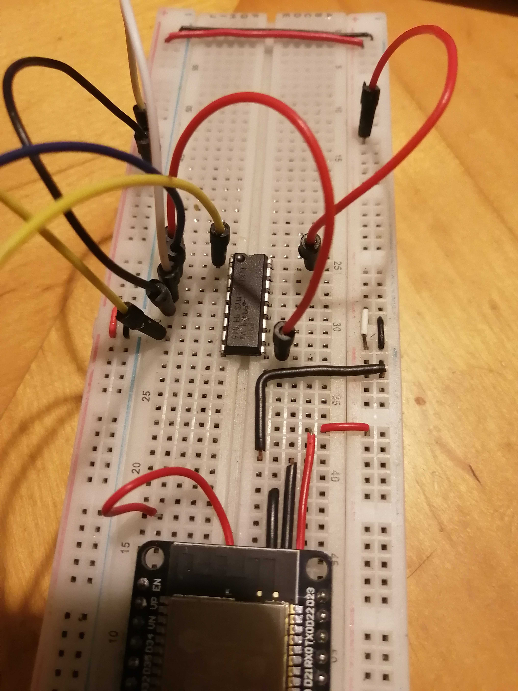
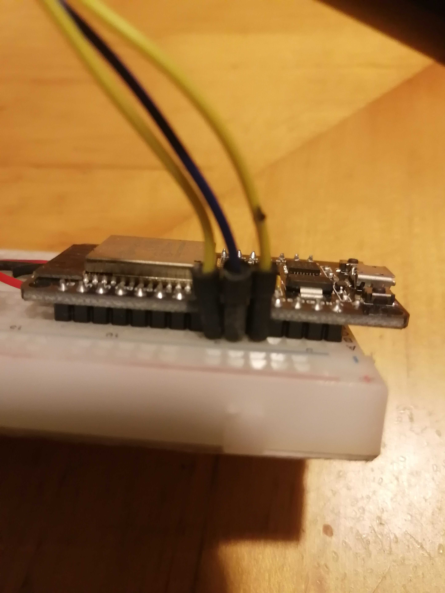
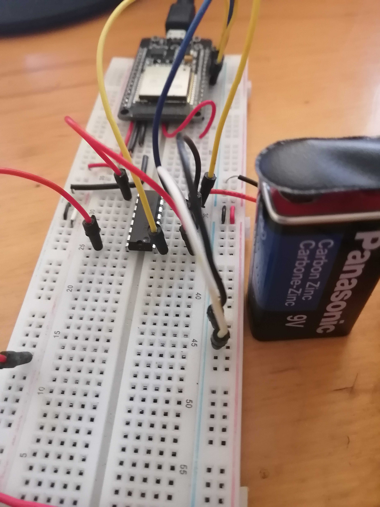
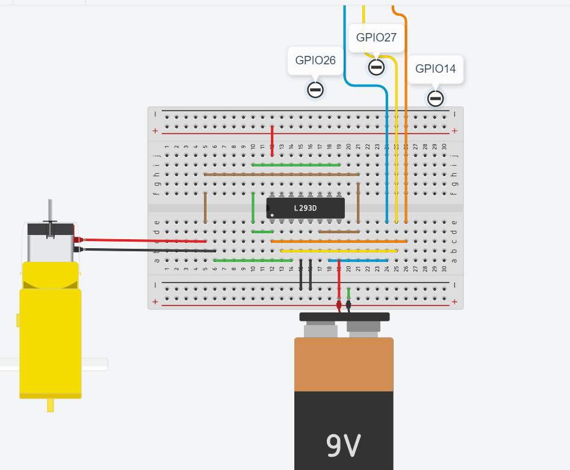
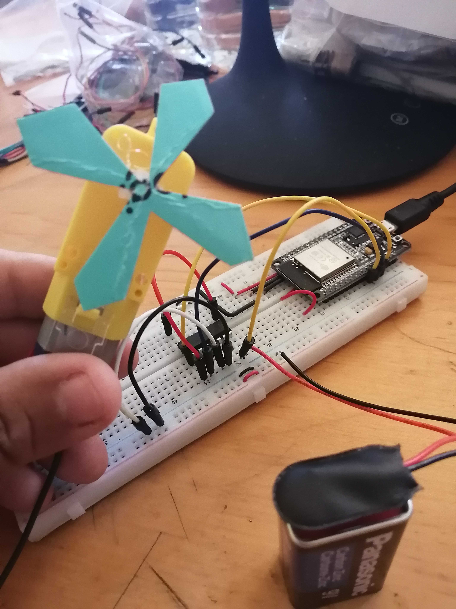
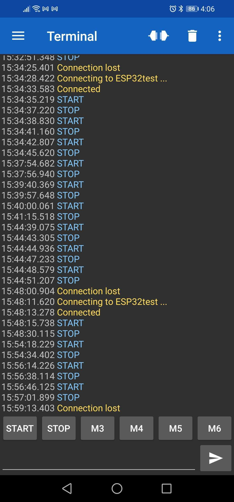
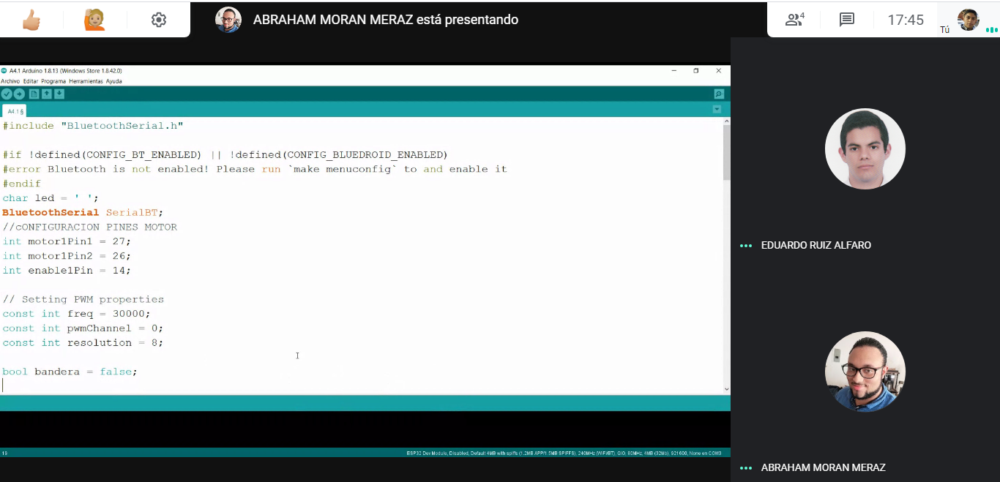
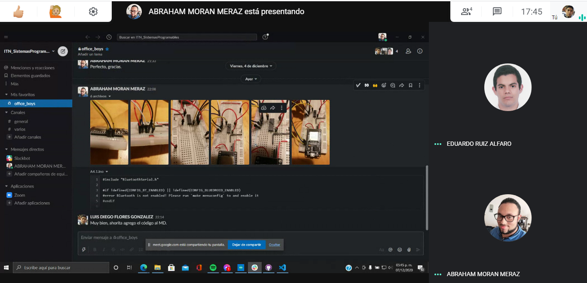

# :trophy: A4.1 Actividad de aprendizaje

Circuito de control para activar y desactivar un motor DC, utilizando NodeMCU ESP32 por medio de Bluetooth

---

## Instrucciones

- Realizar un sistema ensamblado de control por medio de **Bluetooth**, capaz de control a un motor DC, utilizando un NodeMCU **ESP32**, un y un **IC L293D**.
- Toda actividad o reto se deberá realizar utilizando el estilo **MarkDown con extension .md** y el entorno de desarrollo VSCode, debiendo ser elaborado como un documento **single page**, es decir si el documento cuanta con imágenes, enlaces o cualquier documento externo debe ser accedido desde etiquetas y enlaces, y debe ser nombrado con la nomenclatura **A4.1_NombreApellido_Equipo.pdf.**
- Es requisito que el .md contenga una etiqueta del enlace al repositorio de su documento en GITHUB, por ejemplo **Enlace a mi GitHub** y al concluir el reto se deberá subir a github.
- Desde el archivo **.md** exporte un archivo **.pdf** que deberá subirse a classroom dentro de su apartado correspondiente, sirviendo como evidencia de su entrega, ya que siendo la plataforma **oficial** aquí se recibirá la calificación de su actividad.
- Considerando que el archivo .PDF, el cual fue obtenido desde archivo .MD, ambos deben ser idénticos.
- Su repositorio ademas de que debe contar con un archivo **readme**.md dentro de su directorio raíz, con la información como datos del estudiante, equipo de trabajo, materia, carrera, datos del asesor, e incluso logotipo o imágenes, debe tener un apartado de contenidos o indice, los cuales realmente son ligas o **enlaces a sus documentos .md**, _evite utilizar texto_ para indicar enlaces internos o externo.
- Se propone una estructura tal como esta indicada abajo, sin embargo puede utilizarse cualquier otra que le apoye para organizar su repositorio.

```
- readme.md
  - blog
    - C4.1_TituloActividad.md
    - C4.2_TituloActividad.md
    - C4.3_TituloActividad.md
    - C4.4_TituloActividad.md
  - img
  - docs
    - A4.1_TituloActividad.md
    - A4.2_TituloActividad.md
    - A4.3_TituloActividad.md
```

---

### Fuentes de apoyo para desarrollar la actividad

- [x] [Random Nerd Tutorial DHT Humedad y temperatura](https://randomnerdtutorials.com/esp32-dht11-dht22-temperature-humidity-sensor-arduino-ide/)
- [x] [Motor DC con IC L293 y ESP32](https://www.hackster.io/Oniichan_is_ded/l293d-with-esp32-wemos-lolin-d32-v2-hacked-edition-ea2086)

---

## Desarrollo

1.Utilizar el siguiente listado de materiales para la elaboración de la actividad

| Cantidad | Descripción                                                                                                                                                                                                                |
| -------- | -------------------------------------------------------------------------------------------------------------------------------------------------------------------------------------------------------------------------- |
| 1        | [IC L293D]([https://www.amazon.com.mx/330ohms-M%C3%B3dulo-Sensor-Humedad-Temperatura/dp/B07Q4KWJQY/ref=sr_1_1?__mk_es_MX=%C3%85M%C3%85%C5%BD%C3%95%C3%91&dchild=1&keywords=sensor+dht11&qid=1599003418&sr=8-1)             |
| 1        | [Fuente de voltaje de 5V](https://www.steren.com.mx/pila-alcalina-9v-cuadrada.html)                                                                                                                                        |
| 1        | [NodeMCU ESP32](https://www.amazon.com.mx/ESP-32-ESP-32S-ESP-WROOM-32-ESP32-S-desarrollo/dp/B07TBFC75Z/ref=sr_1_2?__mk_es_MX=%C3%85M%C3%85%C5%BD%C3%95%C3%91&dchild=1&keywords=esp32&qid=1599003438&sr=8-2)                |
| 1        | [BreadBoard](https://www.amazon.com.mx/Deke-Home-Breadboard-distribuci%C3%B3n-electr%C3%B3nica/dp/B086C9HK7V/ref=sr_1_22?__mk_es_MX=%C3%85M%C3%85%C5%BD%C3%95%C3%91&dchild=1&keywords=breadboard&qid=1599003455&sr=8-22)   |
| 1        | [Jumpers M/M](https://www.amazon.com.mx/ELEGOO-Macho-Hembra-Macho-Macho-Hembra-Hembra-Protoboard/dp/B06ZXSQ5WG/ref=sr_1_1?__mk_es_MX=%C3%85M%C3%85%C5%BD%C3%95%C3%91&dchild=1&keywords=jumper+wires&qid=1599003519&sr=8-1) |
| 1        | [Motor Reductor](https://www.steren.com.mx/motor-reductor-de-doble-eje-tipo-i-3-vcc.html)                                                                                                                                  |

1. Basado en las imágenes que se muestran en las **Figura 1**, ensamblar un circuito electrónico, con la finalidad de obtener un sistema capaz de cumplir con las instrucciones siguientes:

- Por medio de la aplicación "Serial Bluetooth terminal" que puede ser descargada del play Store de google o incluso cualquier otra que considere, se deberá controlar el arranque y apagado de un motor DC, es decir se contara con dos peticiones, la cual una de ellas representara el **"START" y la otra opción "STOP"**
- El motor debe ser capaz de girar a favor de las manecillas del reloj durante 5 segundos, al cumplirse ese tiempo debe frenar 1 segundo e invertirá su giro durante otros 5 segundos, es decir la actividad debe tener la secuencia siguiente: El **stop** puede ser ejecutado en cualquier instante, y el motor estará ejecutando 5s en forward, 1s stop, 5s reverse, 1s stop, 5s forward, 1s stop, 5s reverse,...

<p align="center"> 
    <strong>Figura 1 Circuito ESP32 IC L293 Motor DC</strong>
    
</p>

3. Coloque aquí la imagen del circuito ensamblado

<p align="center"> 
    
</p>
<p align="center"> 
    
</p>
<p align="center"> 
    
</p>

1. Coloque en este lugar el programa creado dentro del entorno de Arduino

```C++
#include "BluetoothSerial.h"
#if !defined(CONFIG_BT_ENABLED) || !defined(CONFIG_BLUEDROID_ENABLED)
#error Bluetooth is not enabled! Please run `make menuconfig` to and enable it
#endif
char led = ' ';
BluetoothSerial SerialBT;
//cONFIGURACION PINES MOTOR
int motor1Pin1 = 27;
int motor1Pin2 = 26;
int enable1Pin = 14;
// Setting PWM properties
const int freq = 30000;
const int pwmChannel = 0;
const int resolution = 8;
bool bandera = false;
unsigned long previousMillis = 0;        // will store last time LED was updated
long OnTime = 5000;           // milliseconds of on-time
long OffTime = 1000;          // milliseconds of off-time
int este = 1;
bool State = true;
void setup() {
  Serial.begin(115200);
  SerialBT.begin("ESP32test"); //Bluetooth device name
  Serial.println("The device started, now you can pair it with bluetooth!");
  //CONFIGURAMOS LOS PINES DEL MOTOR
    // sets the pins as outputs:
  pinMode(motor1Pin1, OUTPUT);
  pinMode(motor1Pin2, OUTPUT);
  pinMode(enable1Pin, OUTPUT);
  // configure LED PWM functionalitites
  ledcSetup(pwmChannel, freq, resolution);
  // attach the channel to the GPIO to be controlled
  ledcAttachPin(enable1Pin, pwmChannel);
    // testing
  Serial.print("Testing DC Motor...");
  ledcWrite(pwmChannel, 255);//MOTOR A MAXIMA POTENCIA
}
void loop() {
  unsigned long currentMillis = millis();
  verifica();
  if((este == 1) && (bandera == true) && (State == true) && (currentMillis - previousMillis >= OnTime))
  {
    State = false;
    previousMillis = currentMillis;  // Remember the time
    digitalWrite(motor1Pin1, LOW);
    digitalWrite(motor1Pin2, LOW);

  }
  else if ((bandera == true) && (State == false) && (currentMillis - previousMillis >= OffTime))
  {
    if (este == 1)
      {
        State = true;
        previousMillis = currentMillis;   // Remember the time
        digitalWrite(motor1Pin1, HIGH);
        digitalWrite(motor1Pin2, LOW);
        este = 2;
      }
    else if (este == 2)
      {
        State = true;
        previousMillis = currentMillis;   // Remember the time
        digitalWrite(motor1Pin1, LOW);
        digitalWrite(motor1Pin2, HIGH);
        este = 1;
      }
  }
  else if ((este == 2) && (bandera == true) && (State == true) && (currentMillis - previousMillis >= OnTime))
  {
    State = false;
    previousMillis = currentMillis;   // Remember the time
    digitalWrite(motor1Pin1, LOW);
    digitalWrite(motor1Pin2, LOW);

  }
  else if ((bandera == false) && (State == true))
  {
    State = false;
    previousMillis = currentMillis;  // Remember the time
    digitalWrite(motor1Pin1, LOW);
    digitalWrite(motor1Pin2, LOW);
  }
}
bool verifica(){
  if (SerialBT.available()) {
    led = SerialBT.read();
    if(led == 'S'){
      bandera = true;
      }else{
        if(led == 'T'){
          bandera = false;
          return false;
          }else{
          }
      }
    }
    return true;
}
```

# [Link: Video con el funcionamiento corregido](https://vm.tiktok.com/ZMJqkNn1y/)

5. Coloque aquí evidencias que considere importantes durante el desarrollo de la actividad.

<p align="center"> 
    
</p>

<p align="center"> 
    
</p>

<p align="center"> 
    
</p>

<p align="center"> 
    
</p>

<p align="center"> 
    
</p>

1. Conclusiones:

Flores Gonzalez Luis Diego: En la práctica se realizó el circuito para controlar la secuencia de un motor DC a través de ESP32 y el programa desarrollado, en este caso en particular se implementó el uso del Bluetooth integrado del microprocesador para realizar el control como tal de la funcionalidad al permitir comunicar los estados del motor con el uso de una aplicación de play store. Está practica nos demuestra la facilidad que existe de implementar las comunicaciones en este caso de forma básica pero efectiva, abriendo el campo para implementar entornos más complejos que resulten el aplicaciones tecnológicas enfocados al IoT. Por eso esta práctica sirvió para mostrarnos las posibilidades existentes con las herramientas y conocimientos adecuados enfocados al uno de controladores y los medios de comunicación convencionales.

Moran Meraz Abraham: Fue una practica muy interesante, ya antes habíamos trabajado con motores pero combinarlo con el esp32, el l293d y la tecnologia bloetood integrada del esp32 lo hizo todo más interesante y un poco complicado, al principio de la práctica las conexiones con el l293d y el motor no respondian nos tomó tiempo percatarnos de la falla, era un simple cable pero todo esto nos permite conocer más los proyectos que podríamos realizar con el esp32. En lo personal solo conocía arduino pero me está fascinando trabajar con el esp32 por su costo y todas las funcionalidades que tiene me parece algo muy prometedor.

Ruiz Alfaro Eduardo: La practica que se realizo, fue el envio de datos por bluetooth desde el esp32 a un celular para de esta manera, encender un motor DC. Esto fue bastente practico de ver, para entender como es que se puede controlar con un pequeño microcontrolador, sensores o actuadores, con esto saber que existen maneras de manipular cosas de manera inalambrica, y saber que hay opciones de crear aparatos o sistemas donde se envien los datos de esta manera que pueden ser muy utiles para esta nueva industria y una de sus ramificaciones que es el Internet de las Cosas. Bastante util, este conocimiento de conecciones inalabricas y todavia falta conocer la coneccion por wi-fi.

---

### :bomb: Rubrica

| Criterios     | Descripción                                                                                 | Puntaje |
| ------------- | ------------------------------------------------------------------------------------------- | ------- |
| Instrucciones | Se cumple con cada uno de los puntos indicados dentro del apartado Instrucciones?           | 10      |
| Desarrollo    | Se respondió a cada uno de los puntos solicitados dentro del desarrollo de la actividad?    | 60      |
| Demostración  | El alumno se presenta durante la explicación de la funcionalidad de la actividad?           | 20      |
| Conclusiones  | Se incluye una opinión personal de la actividad por cada uno de los integrantes del equipo? | 10      |

# :open_file_folder: [>>>>>Enlace a mi GitHub: Diego Flores<<<<<](https://github.com/Diego-FloresG/Sistemas_Programables_Practicas) :open_file_folder:

# :open_file_folder: [>>>>>Enlace a mi GitHub: Abraham Moran<<<<<](https://github.com/AbrahamMoranMeraz/Sistemas_Prog) :open_file_folder:

# :open_file_folder: [>>>>>Enlace a mi GitHub: Eduardo Ruiz<<<<<](https://github.com/EduardoRuiz2099/Sistemas-Programables) :open_file_folder:
