# :trophy: A4.2 Actividad de aprendizaje

Circuito sensor de iluminación y actuación de luz NodeMCU ESP32 por medio de Wi-Fi

---

## Instrucciones

- Realizar un sistema de medición y actuación de luz ambiental, utilizando el protocolo de comunicación **Wi-FI**, asi como un NodeMCU **ESP32**, un sensor **LDR**, un diodo LED.
- Toda actividad o reto se deberá realizar utilizando el estilo **MarkDown con extension .md** y el entorno de desarrollo VSCode, debiendo ser elaborado como un documento **single page**, es decir si el documento cuanta con imágenes, enlaces o cualquier documento externo debe ser accedido desde etiquetas y enlaces, y debe ser nombrado con la nomenclatura **A4.2_NombreApellido_Equipo.pdf.**
- Es requisito que el .md contenga una etiqueta del enlace al repositorio de su documento en GITHUB, por ejemplo **Enlace a mi GitHub** y al concluir el reto se deberá subir a github.
- Desde el archivo **.md** exporte un archivo **.pdf** que deberá subirse a classroom dentro de su apartado correspondiente, sirviendo como evidencia de su entrega, ya que siendo la plataforma **oficial** aquí se recibirá la calificación de su actividad.
- Considerando que el archivo .PDF, el cual fue obtenido desde archivo .MD, ambos deben ser idénticos.
- Su repositorio ademas de que debe contar con un archivo **readme**.md dentro de su directorio raíz, con la información como datos del estudiante, equipo de trabajo, materia, carrera, datos del asesor, e incluso logotipo o imágenes, debe tener un apartado de contenidos o indice, los cuales realmente son ligas o **enlaces a sus documentos .md**, _evite utilizar texto_ para indicar enlaces internos o externo.
- Se propone una estructura tal como esta indicada abajo, sin embargo puede utilizarse cualquier otra que le apoye para organizar su repositorio.

```
- readme.md
  - blog
    - C4.1_TituloActividad.md
    - C4.2_TituloActividad.md
    - C4.3_TituloActividad.md
    - C4.4_TituloActividad.md
  - img
  - docs
    - A4.1_TituloActividad.md
    - A4.2_TituloActividad.md
    - A4.3_TituloActividad.md
```

---

### Fuentes de apoyo para desarrollar la actividad

- [x] [ESP32 Web Server](https://randomnerdtutorials.com/esp32-web-server-arduino-ide/)
- [x] [LDR con ESP32](https://www.youtube.com/watch?v=A3qcN2mzv0Q)

---

## Desarrollo

1.Utilizar el siguiente listado de materiales para la elaboración de la actividad

| Cantidad | Descripción                                                                                                                                                                                                                |
| -------- | -------------------------------------------------------------------------------------------------------------------------------------------------------------------------------------------------------------------------- |
| 1        | [Modulo Sensor LDR](https://articulo.mercadolibre.com.mx/MLM-623282168-modulo-sensor-de-luz-ldr-_JM)                                                                                                                       |
| 1        | [Rele de 3.3v](https://www.circuitbasics.com/wp-content/uploads/2015/11/SRD-05VDC-SL-C-Datasheet.pdf)                                                                                                                      |
| 1        | [Bombilla](<https://www.bualsaelectrico.com/upload/FT-3726%20(F3704,%20F3705,%20F3706)%20Bombilla%20LED%20G4%201.5W.pdf>)                                                                                                  |
| 1        | [Fuente de voltaje de 5V](https://shopdelta.eu/pdf.php?page=shop/instruction&product_id=7952)                                                                                                                              |
| 1        | [NodeMCU ESP32](https://www.amazon.com.mx/ESP-32-ESP-32S-ESP-WROOM-32-ESP32-S-desarrollo/dp/B07TBFC75Z/ref=sr_1_2?__mk_es_MX=%C3%85M%C3%85%C5%BD%C3%95%C3%91&dchild=1&keywords=esp32&qid=1599003438&sr=8-2)                |
| 1        | [BreadBoard](https://www.amazon.com.mx/Deke-Home-Breadboard-distribuci%C3%B3n-electr%C3%B3nica/dp/B086C9HK7V/ref=sr_1_22?__mk_es_MX=%C3%85M%C3%85%C5%BD%C3%95%C3%91&dchild=1&keywords=breadboard&qid=1599003455&sr=8-22)   |
| 1        | [Jumpers M/M](https://www.amazon.com.mx/ELEGOO-Macho-Hembra-Macho-Macho-Hembra-Hembra-Protoboard/dp/B06ZXSQ5WG/ref=sr_1_1?__mk_es_MX=%C3%85M%C3%85%C5%BD%C3%95%C3%91&dchild=1&keywords=jumper+wires&qid=1599003519&sr=8-1) |

2. Basado en la imágen que se muestran en las **Figura 1**, ensamble un circuito electrónico y agregue un Led y un rele a una de las terminales del dispositivo, de tal manera que se pueda obtener un sistema capaz de cumplir con las instrucciones siguiente:
   - Se deberá utilizar el NodeMCU como un **standalone Web server**, el cual deberá proveer una interface visual, que mostrara una imagen representando un comportamiento de "ON y OFF" dependiendo de la condición de iluminación ambiental.
   - El sensor de iluminación deberá estar midiendo la cantidad de luz que existen en el ambiente.
   - Al momento de detectar el sensor LDR, ausencia de luz deberá mostrar en la interface Web un estado "ON", y en caso contrario deberá representarse el estado "OFF".
   - Al circuito de la figura 1 se le deberá agregar un relevador en serie con una bombilla, que sera activada en condición opuesta al estado "ON" y "OFF", es decir una vez que el sensor detecto poca o nula iluminación activara el rele y por consecuencia encenderá la bombilla, y en caso contrario lo apagara.

[Fuente de apoyo Random Nerd Tutorial](https://randomnerdtutorials.com/esp32-web-server-arduino-ide/)

<p align="center"> 
    <strong>Figura 1 Circuito ESP32 Sensor LDR iluminacion</strong>
    
</p>

3. Coloque aquí la imagen del circuito ensamblado

ESQUEMATICO

<p align="center"> 
    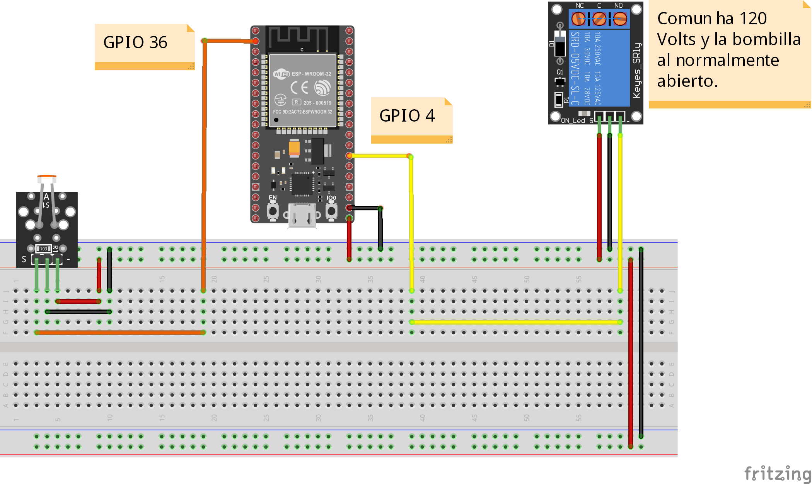
</p>

<p align="center"> 
    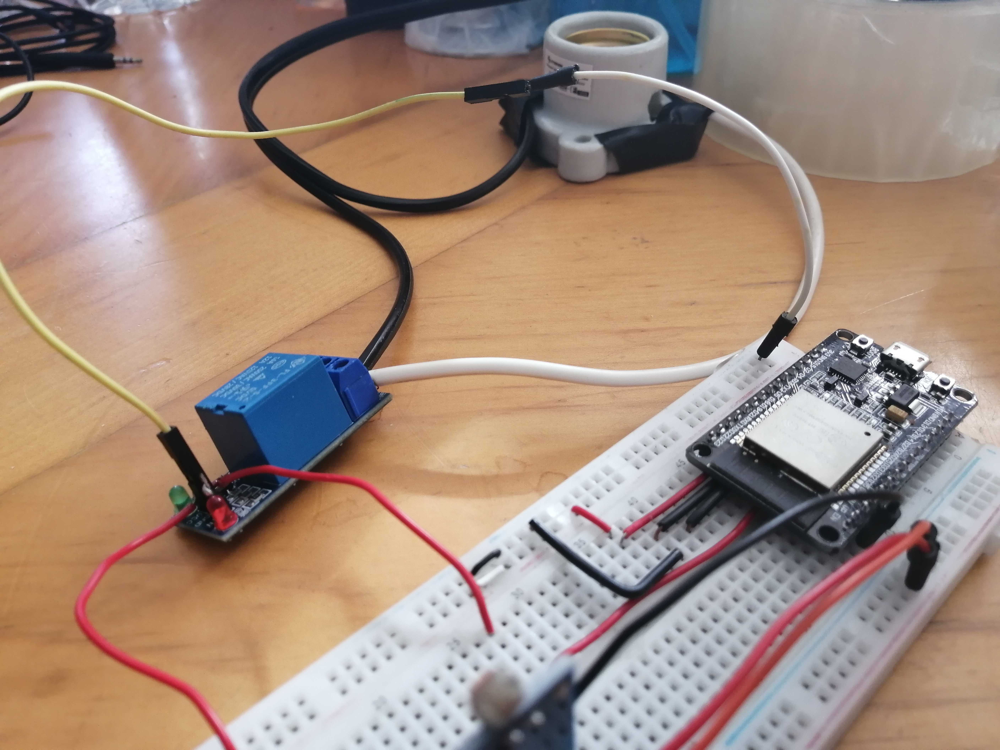
</p>

<p align="center"> 
    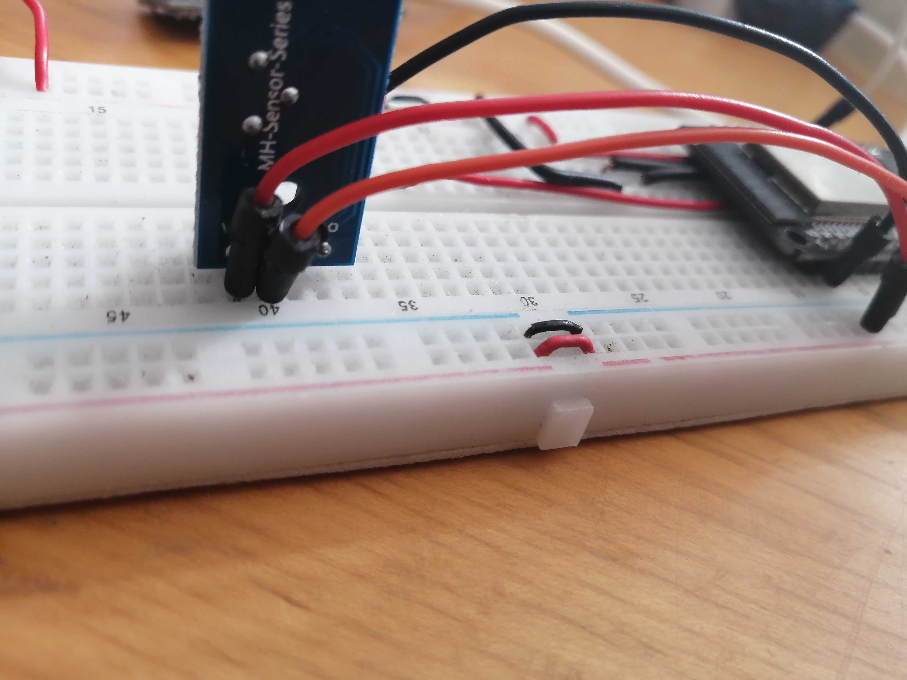
</p>

<p align="center"> 
    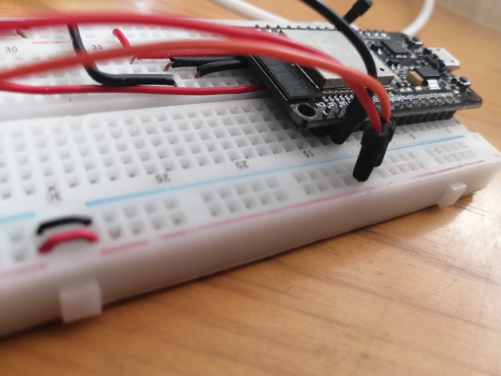
</p>

<p align="center"> 
    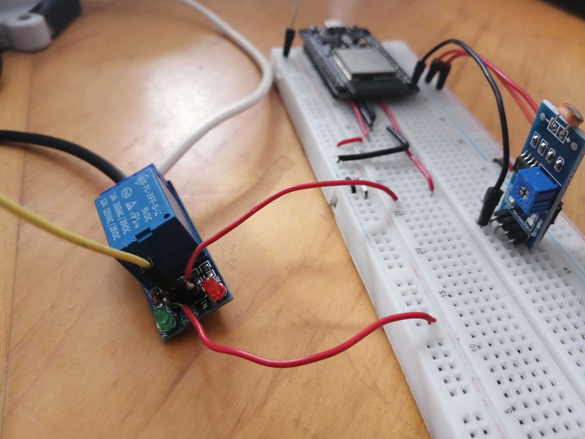
</p>

<p align="center"> 
    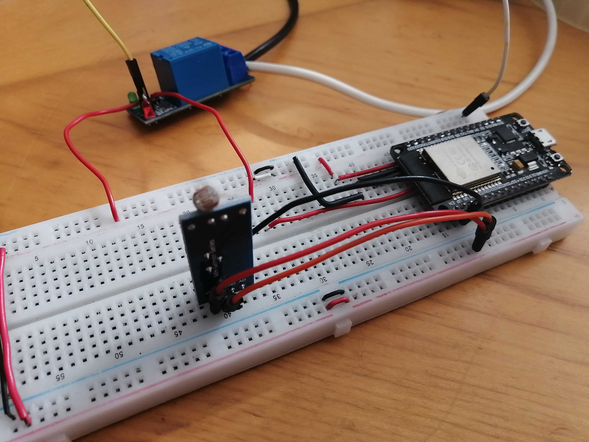
</p>

<p align="center"> 
    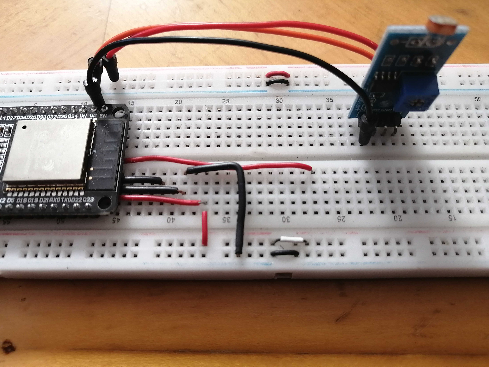
</p>

<p align="center"> 
    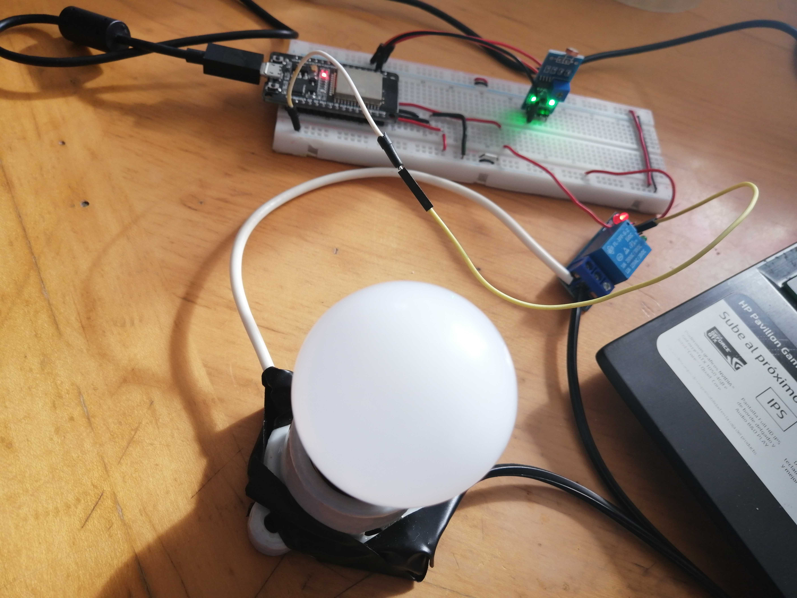
</p>

<p align="center"> 
    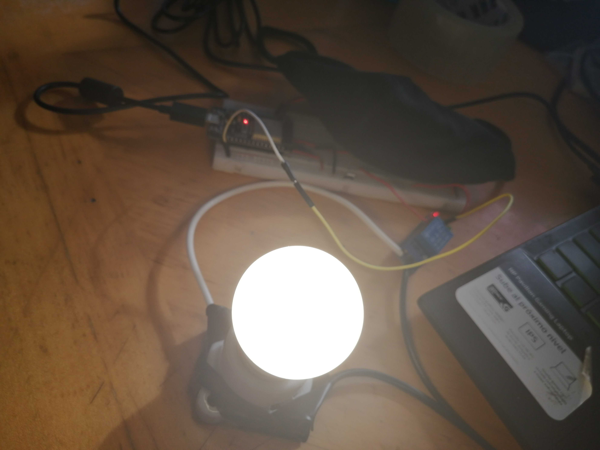
</p>

4. Coloque en este lugar el programa creado dentro del entorno de Arduino

```C++
#include <WiFi.h>
#include <AsyncTCP.h>
#include <ESPAsyncWebServer.h>
//Configuracion de credenciales para acceso a internet
const char* ssid = "SSID";
const char* password = "PASSWORD";
//Tiempos para prender el foco dependiendo la luz
unsigned long previousMillis = 0;
const long interval = 1000;
//Pins para el relay, LDR y variable para la cantidad de luz medida
const int relay = 4;
const int potPin = 36;
int potValue = 0;
//Configuracion del PWM para prender y apagar foco
const int freq = 5000;
const int ledChannel = 0;
const int resolution = 8;
//Archivo HTML
const char index_html[] PROGMEM = R"rawliteral(<!DOCTYPE html>
<html lang="en">
  <head>
    <meta charset="UTF-8" />
    <meta name="viewport" content="width=device-width, initial-scale=1.0" />
    <meta http-equiv="X-UA-Compatible" content="ie=edge" />
    <title>Static Template</title>
    <style>
      html {
        font-family: Helvetica;
        display: inline-block;
        margin: 0px auto;
        text-align: center;
      }
      .div {
        padding: 1%;
        margin-left: 40%;
        margin-right: 40%;
        margin-top: 0%;
        background-color: #fff556;
      }
      .div2 {
        background-color: #555555;
      }
      .label {
        color: white;
        font-size: 20px;
      }
    </style>
  </head>
  <body>
    <h1>
      ESP32 Web Server
    </h1>
    <h2>
      Cantidad de iluminacion:
      <p id="luz">%ILUMINACION%</p>
    </h2>
    <p>
      GPIO 04 - State:
      <p id="estado">%ESTADO%</p>
    </p>
    
  </body>
  <script>
    setInterval(function () {
      var xhttp = new XMLHttpRequest();
      xhttp.onreadystatechange = function () {
        if (this.readyState == 4 && this.status == 200) {
          document.getElementById("luz").innerHTML = this.responseText;
        }
      };
      xhttp.open("GET", "/luz", true);
      xhttp.send();
    }, 1000);
    setInterval(function () {
      var xhttp = new XMLHttpRequest();
      xhttp.onreadystatechange = function () {
        if (this.readyState == 4 && this.status == 200) {
          var element = document.getElementById("estado");
          element.innerHTML = this.responseText;
            if(element.innerHTML == "on"){
              document.getElementById("my_image").src = "https://www.w3schools.com/js/pic_bulbon.gif";
            }else if(element.innerHTML == "off"){
              document.getElementById("my_image").src = "https://www.w3schools.com/js/pic_bulboff.gif";
            }
        }
      };
      xhttp.open("GET", "/estado", true);
      xhttp.send();
    }, 1000);
  </script>
</html>
)rawliteral";
//Metodos para leer luz y el estado del foco
String readLuz() {
  potValue = analogRead(potPin);
  Serial.println(potValue);
  return String(potValue);
}
String readStatus() {
  potValue = analogRead(potPin);
  delay(500);
  if(potValue > 2000){
    Serial.println("on");
    return "on";
  }else{
    Serial.println("off");
    return "off";
  }
}
//Servidor 80
AsyncWebServer server(80);
//Procesos o variables para modificar HTML
String processor(const String& var){
  if(var == "ILUMINACION"){
    return readLuz();
  }
  else if(var == "ESTADO"){
    return readStatus();
  }
  return String();
}
void setup() {
  Serial.begin(115200);
  //Configuracion para WIFI
  WiFi.begin(ssid, password);
  while (WiFi.status() != WL_CONNECTED) {
    delay(1000);
    Serial.println("Connecting to WiFi..");
  }
  Serial.println();
  Serial.print("ESP IP Address: http://");
  Serial.println(WiFi.localIP());
  //Configuracion PWM a relay
  ledcSetup(ledChannel, freq, resolution);
  ledcAttachPin(relay, ledChannel);
  //Sincronizando con la pagina web
  server.on("/", HTTP_GET, [](AsyncWebServerRequest *request){
    request->send_P(200, "text/html", index_html, processor);
  });
  server.on("/luz", HTTP_GET, [](AsyncWebServerRequest *request){
    request->send_P(200, "text/plain", readLuz().c_str());
  });
  server.on("/estado", HTTP_GET, [](AsyncWebServerRequest *request){
    request->send_P(200, "text/plain", readStatus().c_str());
  });
  //Iniciar servidor
  server.begin();
}
void loop() {
  unsigned long currentMillis = millis();
  //Intervalos de tiempo para hacer los cambios dependiendo la luz ambiental
  if (currentMillis - previousMillis >= interval) {
    previousMillis = currentMillis;
    //Lleguendo el sensor LDR
    potValue = analogRead(potPin);
    Serial.println(potValue);
    delay(500);

    if(potValue > 2000){
      String message = String("Prender foco, iluminacion: ") + String(potValue);
      Serial.println(message);
      ledcWrite(ledChannel, 0);
    }
    // Check if temperature is below threshold and if it needs to trigger output
    else if(potValue < 2000) {
      String message = String("Apagar foco, iluminacion: ") + String(potValue);
      Serial.println(message);
      ledcWrite(ledChannel, 255);
    }
  }
}

```

5. Coloque aquí evidencias que considere importantes durante el desarrollo de la actividad.

<p align="center"> 
    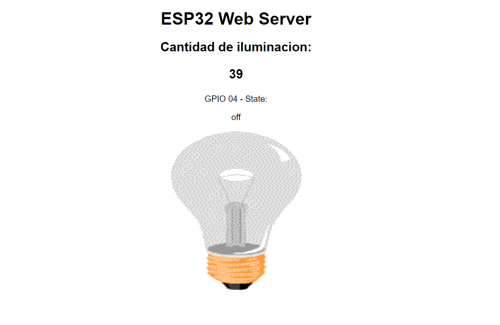
</p>

<p align="center"> 
    
</p>

<p align="center"> 
    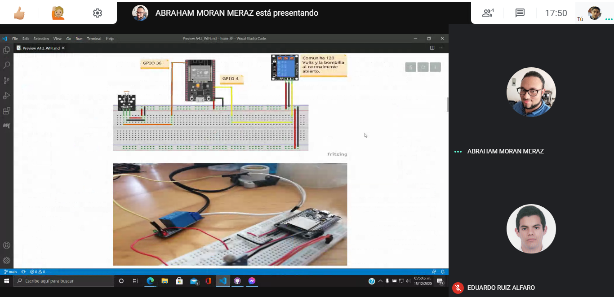
</p>

<p align="center"> 
    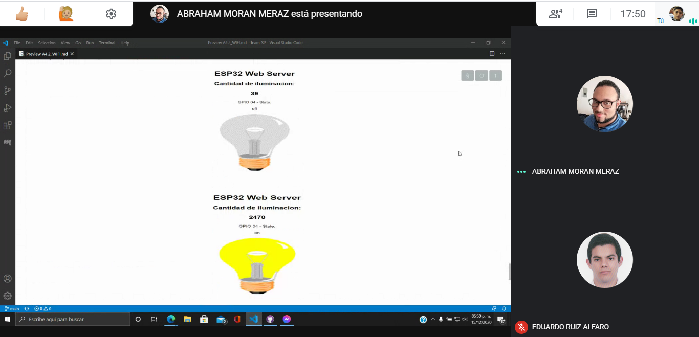
</p>

<p align="center"> 
    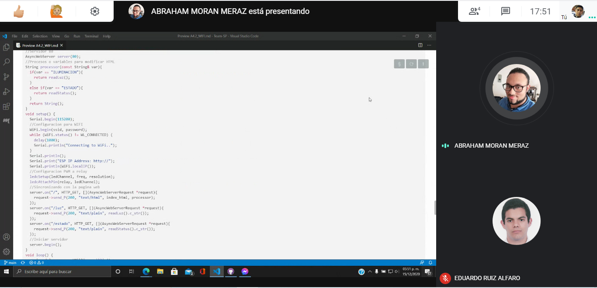
</p>

<p align="center"> 
    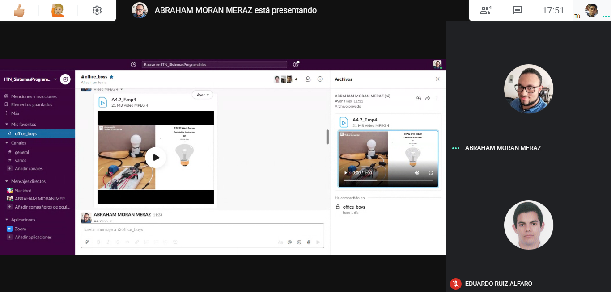
</p>

6. Conclusiones

Moran Meraz Abraham: Esta practica fue muy interesante por la forma que es posible crear código HTML y CSS en el ide de arduino y como el esp32 se conecta con la red wifi para ser otro dispositivo y poder acceder a su puerto local para visualizar la página. Los cambios se generan en el entorno de pruebas se actualizan casi en tiempo real en la página diseñada que el esp32 está mostrando. Aprendimos mucho sobre el funcionamiento del wifi y su función como servidor, si tuviéramos que recalcar algo seria que cuando el esp32, esta funcionando como web ser los pines analógicos ADC2 no funcionan, lo cual abría sido bueno saber pues nos genero muchos dolores de cabeza durante el desarrollo de esta práctica.

Ruiz Alfaro Eduardo: Esta practica fue un poco mas complicado de lo imaginado pero a la vez fue muy util en el aprendizaje que se dio, ya no solo fue conectar por wi-fi, si no, hacer un servidor el esp32 y todavia hacer el uso de HTML y CSS para crear una pequeña pagina donde se mostraran los datos, y tambien todavia el uso de una bombilla, ya fue algo mas completo de las aplicaciones de este pequeño microcontrolador. Hay cosas que se notaron como en el uso de los pines para el envio de datos wi-fi, unos no funcionaban totalmente para el envio de datos, como otros. Fue bastante interesante ver como el esp32 puede dar otro uso y no solo de controlar con cables, si no, controlar cosas via inalambricas, con esto, podremos hacer cosas mas complejos con envio de datos y hacer uso de IoT.

Flores Gonzalez Luis Diego: En la práctica se realizó el circuito correspondiente para manejar el prender y apagar de un relé conectado a un foco incandescente, este está configurado para prenderse y apagarse según la iluminación ambiental a través de un LDR. Esta práctica implementó un servicio web al tener que visualizar los datos en tiempo real de la cantidad de luz medida y se debía mostrar una imagen representativa del prender y apagar el foco. Para hacer esto fue necesario implementar librerías que permitan el acceso al wifi y otra que permita realizar un sincronización de los datos del dispositivo físico a la interfaz web. Para el desarrollo de la práctica se implementaron una variedad de pruebas al presentarse problemas tanto en la lógica para mostrar datos que cambien sin hacer un refresh y otro al no conocer que al usar el wifi algunos pins analogicos mandaban datos erroneos, pero ya al final todo se termino de la manera correcta.

---

### :bomb: Rubrica

| Criterios     | Descripción                                                                                 | Puntaje |
| ------------- | ------------------------------------------------------------------------------------------- | ------- |
| Instrucciones | Se cumple con cada uno de los puntos indicados dentro del apartado Instrucciones?           | 10      |
| Desarrollo    | Se respondió a cada uno de los puntos solicitados dentro del desarrollo de la actividad?    | 60      |
| Demostración  | El alumno se presenta durante la explicación de la funcionalidad de la actividad?           | 20      |
| Conclusiones  | Se incluye una opinión personal de la actividad por cada uno de los integrantes del equipo? | 10      |

# :open_file_folder: [>>>>>Enlace a mi GitHub: Diego Flores<<<<<](https://github.com/Diego-FloresG/Sistemas_Programables_Practicas) :open_file_folder:

# :open_file_folder: [>>>>>Enlace a mi GitHub: Abraham Moran<<<<<](https://github.com/AbrahamMoranMeraz/Sistemas_Prog) :open_file_folder:

# :open_file_folder: [>>>>>Enlace a mi GitHub: Eduardo Ruiz<<<<<](https://github.com/EduardoRuiz2099/Sistemas-Programables) :open_file_folder:
