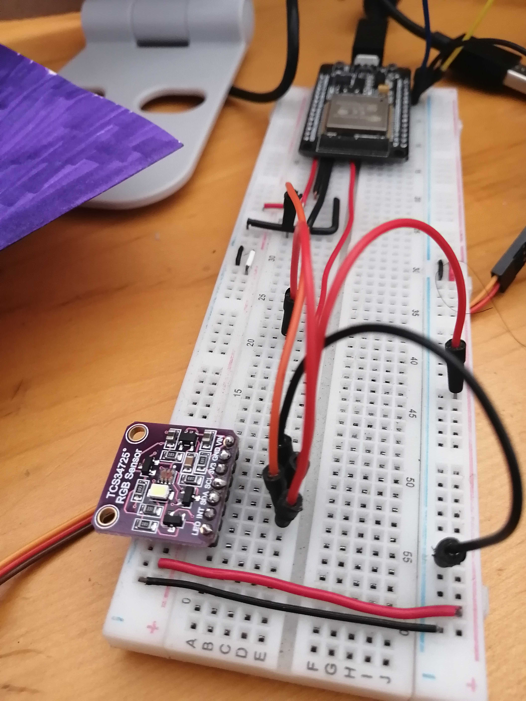
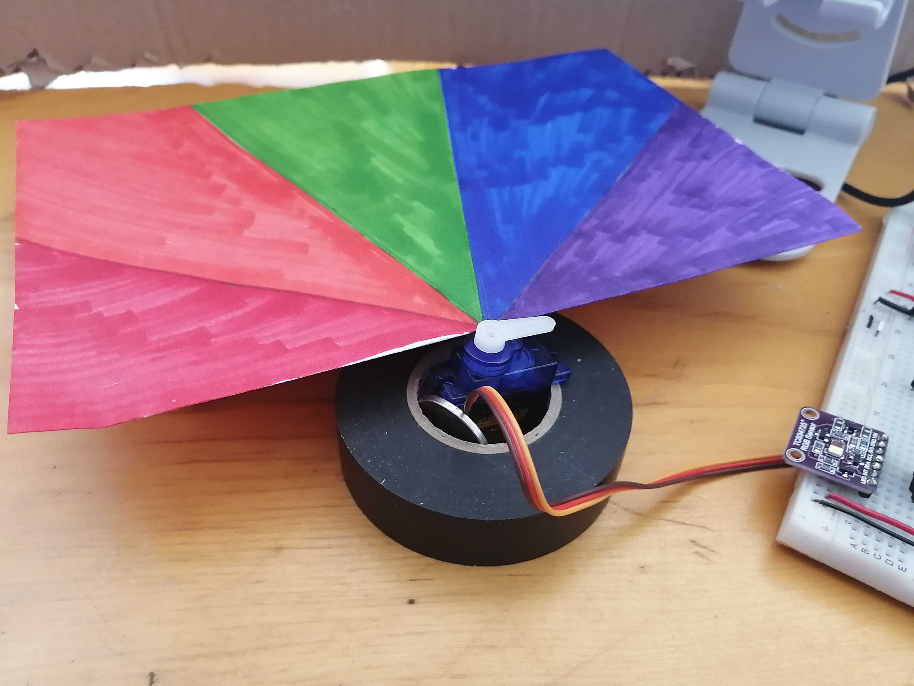
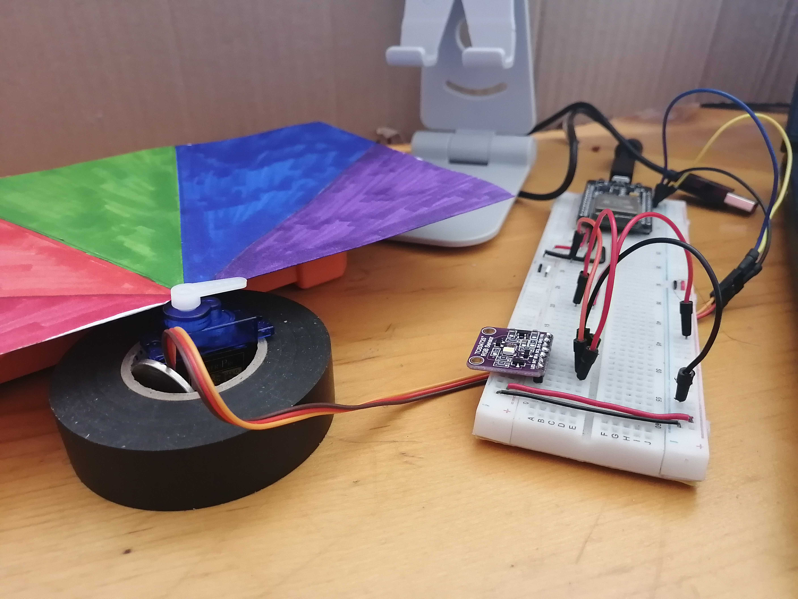
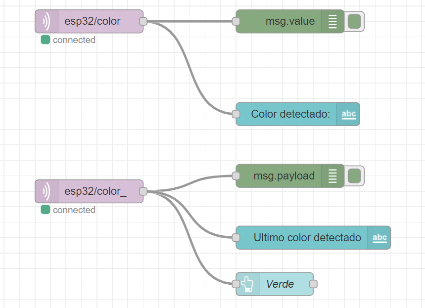
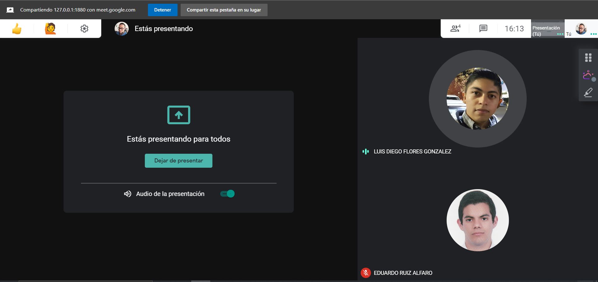
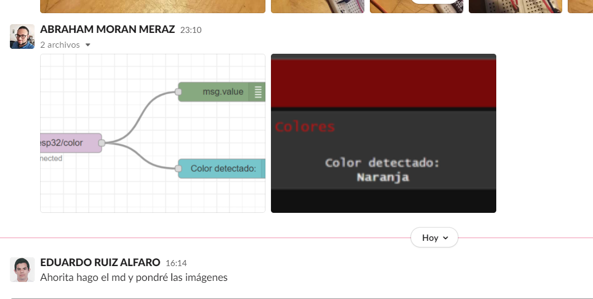
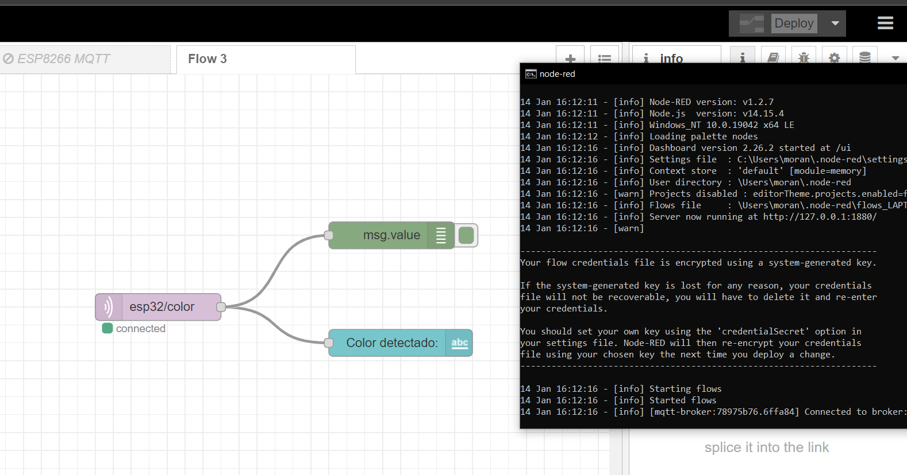
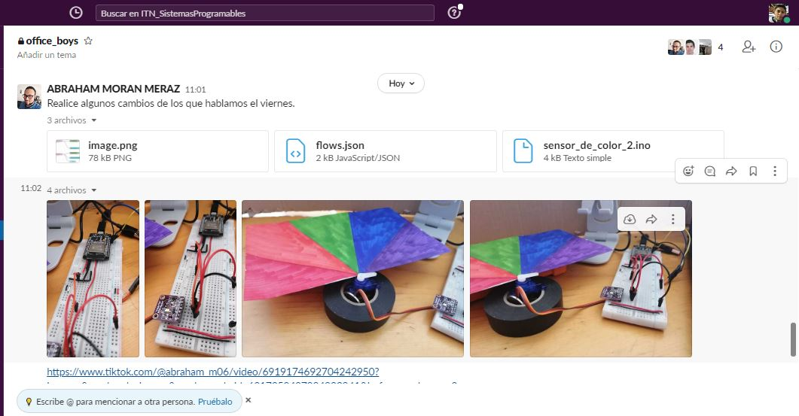

# :trophy: A5.2 Actividad de aprendizaje

Sistema sensor y actuacion del color de un objeto, e interface visual

---

## Instrucciones

- Realizar un sistema de identificacion de color utilizando un sensor de RGB TCS34725, un nodeMCU ESP32, un actuador Servomotor SG90, cualquier protocolo de comunicación y una interface visual que puede ser desarrollada por el equipo o apoyandose de otras como Node-red por ejemplo.
- Toda actividad o reto se deberá realizar utilizando el estilo **MarkDown con extension .md** y el entorno de desarrollo VSCode, debiendo ser elaborado como un documento **single page**, es decir si el documento cuanta con imágenes, enlaces o cualquier documento externo debe ser accedido desde etiquetas y enlaces, y debe ser nombrado con la nomenclatura **A5.2_NombreApellido_Equipo.pdf.**
- Es requisito que el .md contenga una etiqueta del enlace al repositorio de su documento en GITHUB, por ejemplo **Enlace a mi GitHub** y al concluir el reto se deberá subir a github.
- Desde el archivo **.md** exporte un archivo **.pdf** que deberá subirse a classroom dentro de su apartado correspondiente, sirviendo como evidencia de su entrega, ya que siendo la plataforma **oficial** aquí se recibirá la calificación de su actividad.
- Considerando que el archivo .PDF, el cual fue obtenido desde archivo .MD, ambos deben ser idénticos.
- Su repositorio ademas de que debe contar con un archivo **readme**.md dentro de su directorio raíz, con la información como datos del estudiante, equipo de trabajo, materia, carrera, datos del asesor, e incluso logotipo o imágenes, debe tener un apartado de contenidos o indice, los cuales realmente son ligas o **enlaces a sus documentos .md**, _evite utilizar texto_ para indicar enlaces internos o externo.
- Se propone una estructura tal como esta indicada abajo, sin embargo puede utilizarse cualquier otra que le apoye para organizar su repositorio.

```
- readme.md
  - blog
    - C5.1_TituloActividad.md
    - C5.2_TituloActividad.md
  - img
  - docs
    - A5.1_TituloActividad.md
    - A5.2_TituloActividad.md
```

---

## Desarrollo

1. Utilizar el siguiente listado de materiales para la elaboración de la actividad

| Cantidad | Descripción                                                                                                                                                                                                                |
| -------- | -------------------------------------------------------------------------------------------------------------------------------------------------------------------------------------------------------------------------- |
| 1        | [Sensor RGB TCS34725](https://cdn-shop.adafruit.com/datasheets/TCS34725.pdf)                                                                                                                                               |
| 1        | [Servomotor SG90](http://www.ee.ic.ac.uk/pcheung/teaching/DE1_EE/stores/sg90_datasheet.pdf)                                                                                                                                |
| 1        | [Fuente de voltaje de 5V](https://shopdelta.eu/pdf.php?page=shop/instruction&product_id=7952)                                                                                                                              |
| 1        | [NodeMCU ESP32](https://www.amazon.com.mx/ESP-32-ESP-32S-ESP-WROOM-32-ESP32-S-desarrollo/dp/B07TBFC75Z/ref=sr_1_2?__mk_es_MX=%C3%85M%C3%85%C5%BD%C3%95%C3%91&dchild=1&keywords=esp32&qid=1599003438&sr=8-2)                |
| 1        | [BreadBoard](https://www.amazon.com.mx/Deke-Home-Breadboard-distribuci%C3%B3n-electr%C3%B3nica/dp/B086C9HK7V/ref=sr_1_22?__mk_es_MX=%C3%85M%C3%85%C5%BD%C3%95%C3%91&dchild=1&keywords=breadboard&qid=1599003455&sr=8-22)   |
| 1        | [Jumpers M/M](https://www.amazon.com.mx/ELEGOO-Macho-Hembra-Macho-Macho-Hembra-Hembra-Protoboard/dp/B06ZXSQ5WG/ref=sr_1_1?__mk_es_MX=%C3%85M%C3%85%C5%BD%C3%95%C3%91&dchild=1&keywords=jumper+wires&qid=1599003519&sr=8-1) |

2. Basado en las imágenes que se muestran en las **Figura 1**, realizar un sistema capaz de cumplir con las siguientes condiciones:

   - La primer fase de la actividad consistira en, al colocar un objeto frente al sensor RGB, este debera identificar que color tiene (es recomendable utiizar objetos de color Rojo, Verde, y Azul para mayor precision), el cual debera mostrar en un interface visual que color fue detectado.
   - La segunda fase, consistira en agregar un actuador que y un identificador de color apoyandose de una banda de colores como se muestra en la imagen 1; al conocer el color del objeto el actuador debera apuntar al color que se esta detectando.

 <p align="center"> 
    <strong>Figura 1 Circuito ESP32 Sensor de color y Servomotor</strong>
    
</p>

3. Coloque aquí la imagen del circuito ensamblado

<p align="center"> 
    
</p>

<p align="center"> 
    
</p>

<p align="center"> 
    
</p>

4. Coloque en este lugar el programa creado dentro del entorno de Arduino

```C++

#include <WiFi.h>
#include <PubSubClient.h>
#include <Wire.h>
#include "Adafruit_TCS34725.h"
#include "ColorConverterLib.h"
#include <Servo.h>
Servo myservo;

// Replace the next variables with your SSID/Password combination
const char* ssid = "**********";
const char* password = "**********";

// Add your MQTT Broker IP address, example:
//const char* mqtt_server = "192.168.1.144";
const char* mqtt_server = "**********";

WiFiClient espClient;
PubSubClient client(espClient);
long lastMsg = 0;

uint16_t redT, greenT, blueT, clearT;
float scaleRedT, scaleGreenT, scaleBlueT;
double nuanceT, saturationT, valueT;
String nameColorT;

Adafruit_TCS34725 tcs = Adafruit_TCS34725(TCS34725_INTEGRATIONTIME_50MS, TCS34725_GAIN_4X);

void setup(void) {
  Serial.begin(9600);
  myservo.attach(13);//motor en pin 13

  if (tcs.begin()) {
  Serial.println("Found sensor");
  } else {
  Serial.println("No TCS34725 found ... check your connections");
  while (1);
  }
  setup_wifi();
  client.setServer(mqtt_server, 1883);
  myservo.write(map(45, 1, 100, 0, 0));
}
void setup_wifi() {
  delay(10);
  // We start by connecting to a WiFi network
  Serial.println();
  Serial.print("Connecting to ");
  Serial.println(ssid);

  WiFi.begin(ssid, password);

  while (WiFi.status() != WL_CONNECTED) {
    delay(500);
    Serial.print(".");
  }

  Serial.println("");
  Serial.println("WiFi connected");
  Serial.println("IP address: ");
  Serial.println(WiFi.localIP());
}

void reconnect() {
  // Loop until we're reconnected
  while (!client.connected()) {
    Serial.print("Attempting MQTT connection...");
    // Attempt to connect
    if (client.connect("ESP8266Client")) {
      Serial.println("connected");
    } else {
      Serial.print("failed, rc=");
      Serial.print(client.state());
      Serial.println(" try again in 5 seconds");
      // Wait 5 seconds before retrying
      delay(5000);
    }
  }
}
// Now we're ready to get readings!
void loop(void) {
  if (!client.connected()) {
    reconnect();
  }
  client.loop();

  long now = millis();
  if (now - lastMsg > 2000) {
  lastMsg = now;

  tcs.setInterrupt(false);
  delay(60);
  tcs.getRawData(&redT, &greenT, &blueT, &clearT);
  tcs.setInterrupt(true);

  scaleRedT = redT;
  scaleRedT = (scaleRedT / clearT ) * 255;

  scaleGreenT = greenT;
  scaleGreenT = (scaleGreenT / clearT ) * 255;

  scaleBlueT = blueT;
  scaleBlueT = (scaleBlueT / clearT ) * 255;

  ColorConverter::RgbToHsv(static_cast<uint16_t>(scaleRedT), static_cast<uint16_t>(scaleGreenT),
                           static_cast<uint16_t>(scaleBlueT), nuanceT, saturationT, valueT);

  nuanceT *= 360;

String color = printColorNameT();
int str_len = color.length() + 1;
    char colorString[str_len];
    color.toCharArray(colorString, str_len);
    Serial.println("Color detectado: " + color + "[" + String(nuanceT) + "]  ");
    Serial.println(colorString);
    client.publish("esp32/color", colorString);

    if (color == "Rojo"){
      myservo.write(165);
      client.publish("esp32/color_", "Red");
    } else if (color == "Verde"){
      myservo.write(93);
      client.publish("esp32/color_", "Green");
    }else if (color == "Azul") {
      myservo.write(70);
      client.publish("esp32/color_", "Blue");
    }else if (color == "Naranja") {
      myservo.write(120);
      client.publish("esp32/color_", "Orange");
    }else if (color == "Morado") {
      myservo.write(40);
      client.publish("esp32/color_", "Purple");
    }
    else{
      myservo.write(0);
    }
  }
}

String printColorNameT() {
  if (nuanceT <= 10 && nuanceT >= 0.1)
    return nameColorT = "Rojo";
  else if (nuanceT <= 15 && nuanceT >= 0.1)
    return nameColorT = "Naranja";
  else if (nuanceT <= 90 && nuanceT >= 0.1)
    return nameColorT = "Amarillo";
  else if (nuanceT <= 150 && nuanceT >= 0.1)
    return nameColorT = "Verde";
  else if (nuanceT <= 210 && nuanceT >= 0.1)
    return nameColorT = "Cyen";
  else if (nuanceT <= 215 && nuanceT >= 0.1)
    return nameColorT = "Azul";
  else if (nuanceT <= 222 && nuanceT >= 0.1)
    return nameColorT = "Morado";
  else
    return nameColorT = "No se encontro Color";
}

```

### Codigo JSON para Node-Red

---

[{"id":"75020358.8ca2dc","type":"tab","label":"Flow 3","disabled":false,"info":""},{"id":"47d3ff23.f4d93","type":"mqtt in","z":"75020358.8ca2dc","name":"","topic":"esp32/color","qos":"2","datatype":"auto","broker":"78975b76.6ffa84","x":210,"y":180,"wires":[["581969af.2e7078","c88995e8.0ee2a8"]]},{"id":"c88995e8.0ee2a8","type":"debug","z":"75020358.8ca2dc","name":"","active":true,"tosidebar":true,"console":false,"tostatus":false,"complete":"value","targetType":"msg","statusVal":"","statusType":"auto","x":470,"y":180,"wires":[]},{"id":"581969af.2e7078","type":"ui*text","z":"75020358.8ca2dc","group":"7cb1c147.22aa5","order":1,"width":"0","height":"0","name":"","label":"Color detectado: ","format":"{{msg.payload}}","layout":"col-center","x":480,"y":300,"wires":[]},{"id":"ba0871.8354779","type":"ui_button","z":"75020358.8ca2dc","name":"Verde","group":"7cb1c147.22aa5","order":3,"width":"6","height":"3","passthru":false,"label":"","tooltip":"","color":"","bgcolor":"{{payload}}","icon":"","payload":"green","payloadType":"str","topic":"","x":450,"y":520,"wires":[[]]},{"id":"da5cda08.c103b8","type":"mqtt in","z":"75020358.8ca2dc","name":"","topic":"esp32/color*","qos":"2","datatype":"auto","broker":"78975b76.6ffa84","x":210,"y":400,"wires":[["ba0871.8354779","7bedf303.e9f2ac","ef481dfa.8ae95"]]},{"id":"7bedf303.e9f2ac","type":"debug","z":"75020358.8ca2dc","name":"","active":true,"tosidebar":true,"console":false,"tostatus":false,"complete":"payload","targetType":"msg","statusVal":"","statusType":"auto","x":470,"y":380,"wires":[]},{"id":"ef481dfa.8ae95","type":"ui_text","z":"75020358.8ca2dc","group":"7cb1c147.22aa5","order":2,"width":0,"height":0,"name":"","label":"Ultimo color detectado","format":"","layout":"row-spread","x":500,"y":460,"wires":[]},{"id":"78975b76.6ffa84","type":"mqtt-broker","name":"","broker":"192.168.0.2","port":"1883","clientid":"TEST","usetls":false,"compatmode":true,"keepalive":"60","cleansession":true,"birthTopic":"","birthQos":"0","birthPayload":"","closeTopic":"","closePayload":"","willTopic":"","willQos":"0","willPayload":""},{"id":"7cb1c147.22aa5","type":"ui_group","name":"Colores","tab":"e0a394f8.695aa8","order":1,"disp":true,"width":"6","collapse":false},{"id":"e0a394f8.695aa8","type":"ui_tab","name":"ESP32","icon":"dashboard","order":2,"disabled":false,"hidden":false}]

---

5. Coloque aquí evidencias que considere importantes durante el desarrollo de la actividad.

# [Enlace a video](https://www.tiktok.com/@abraham_m06/video/6919174692704242950?lang=es&sender_device=pc&sender_web_id=6917050407994983941&is_from_webapp=v2)

<p align="center"> 
    
</p>

<p align="center"> 
    
</p>

<p align="center"> 
    
</p>

<p align="center"> 
    
</p>

<p align="center"> 
    
</p>

<p align="center"> 
    
</p>

6. Para la demostracion de la actividad deberan utilizarse mas de un objeto para poder cubrir minimo tres colores.

7. Conclusiones

Flores Gonzalez Luis Diego: En la práctica se desarrolló un programa que permite identificar los colores de los objetos, fue interesante ver cómo trabaja las librerías en particular la de Convert Color que nos ayudó a identificar los colores según el RGB identificado, ya que si este hubiera sido más complicado identificar todos los colores disponibles. Otras de las cosas peculiares fue el implementar el Node-red nuevamente pera en este caso intentando enviar datos del ESP32 al Servidor, esto por que en el anterior en nuestro caso fue al revés del Servidor al ESP32, ya con este nuevo conocimiento podemos ser más creativos al desarrollar proyectos con esta plataforma que facilita el desarrollar una aplicación web desde cero. Considero que esta práctica representó muchos de los tópicos presentados hasta ahora durante el curso por lo que estoy satisfecho.

Moran Meraz Abraham: Fue una practica muy entretenida nos ayudo mucho a entender el funcionamiento del sensor de color, al inicio todo parecia faciel pero ningun tutorial mostraba como se conectaba de forma correcta el sensor al esp32, despues de un tiempo nos percatamos que el esp32 tiene unas entradas I2C especiales para este tipo de sensores, por lo demas la practica fue muy sencilla gracias al uso de la tecnologia de Node-Red y a las bibliotecas de wifi y servo para conectarese de forma correcta y controlar de forma mas precisa el micro servo, gran experiencia conectado todo para que funcione.

Ruiz Alfaro Eduardo: La practica estuvo interesante por la union del esp32 con un sensor RGB y el uso del servo motor, para apuntar a los colores. El uso de node-red puede ser bastante util si quieres darle una interfaz a la practica que quieres hacer, si es que quieres que alguien mas utilice las aplicaciones de este, sin tener conocimiento de la programacion, en especial porque puede hacer una interfaz colorida y atractiva para utilizar. La parte dificil de esta practica, fue poder hacer que el sensor pudiera identificar los colores, pero con la ayuda de las bibliotecas de Adafruit y ColorConvert, esto se empezo a hacer mas sencillo. Despues de esto, todo lo demas fue mas sencillo como hacer que el servo motor apuntara al color y conectarlo a node-red para darle los botones y facilidad de uso.

---

### :bomb: Rubrica

| Criterios     | Descripción                                                                                 | Puntaje |
| ------------- | ------------------------------------------------------------------------------------------- | ------- |
| Instrucciones | Se cumple con cada uno de los puntos indicados dentro del apartado Instrucciones?           | 10      |
| Desarrollo    | Se respondió a cada uno de los puntos solicitados dentro del desarrollo de la actividad?    | 60      |
| Demostración  | El alumno se presenta durante la explicación de la funcionalidad de la actividad?           | 20      |
| Conclusiones  | Se incluye una opinión personal de la actividad por cada uno de los integrantes del equipo? | 10      |

# :open_file_folder: [>>>>>Enlace a mi GitHub: Diego Flores<<<<<](https://github.com/Diego-FloresG/Sistemas_Programables_Practicas) :open_file_folder:

# :open_file_folder: [>>>>>Enlace a mi GitHub: Abraham Moran<<<<<](https://github.com/AbrahamMoranMeraz/Sistemas_Prog) :open_file_folder:

# :open_file_folder: [>>>>>Enlace a mi GitHub: Eduardo Ruiz<<<<<](https://github.com/EduardoRuiz2099/Sistemas-Programables) :open_file_folder:
