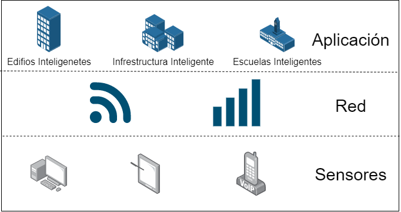

## :trophy: C0.2 Reto en clase

**Conceptos de Industria 4.0 e IOT**

### :blue_book: Instrucciones

- De acuerdo con la información presentada y el video mostrado por el asesor, contestar las preguntas indicadas en la tabla del apartado desarrollo.
- Al concluir el reto se deberá subir en formato PDF a la plataforma con la nomenclatura **C0.2_NombreApellido_Equipo.pdf.**
- Se deberá publicar el reto dentro del repositorio Git personal de cada estudiante, utilizando el estilo MarkDown y el entorno de desarrollo VSCode.
- Es recomendable crear el repositorio siguiente una estructura tal como:
```
- readme.md
  - blog
    - C0.1_x.md
    - C0.2_x.md
  - img
  - docs
    - A0.1_x.md
    - A0.2_x.md
```
  
### :pencil2: Desarrollo

1. Responde a las siguientes preguntas:

| Numero | Pregunta                                            | Respuesta  |
| ------ | --------------------------------------------------- | ---------  |
| 1.1      | A que esta referido el termino Industria conectada? |Se refiere a una nueva forma de organizar los medios de produccion.           |
| 1.2      | ¿Qué es un sistema en tiempo real?                  |Sistemas que tienen restricciones temporales en sus procesamientos, este no depende sólo de los resultados cálculados sino tambien del tiempo que toma hacer estos calculos, garantizan un resultado antes de un determinado tiempo limite.            |
| 1.3      | Mencione que tecnologías envuelven el concepto Industria 4.0    |Instantánea, virtualización, Descentralización, Modularización.           |
| 1.4      | Referente al tema automatización industria, en que consiste el nivel de campo?                        |Son los dispositivos físicos presentes en la industria, como los actuadores y sensores.            |
| 1.5      | Elabore un diagrama de capas que muestre la arquitectura de un ecosistema tecnológico para IOT?                       |            |
| 1.6      | Que es un sistema de control embebido?         | Es un sistema de computación diseñado para realizar una o algunas pocas funciones dedicadas.            |
| 1.7      | Que tecnologías observa en el video referentes al concepto Industria 4.0?         |Análisis y simulación de datos (Big Data), Robótica, Internet de las cosas,  Cloud Computing, Fabricación Aditiva, Realidad Aumentada.           |
| 1.8      | Basado en el video que ha ofrecido la robótica en la industria?        |Automatizan y coordinan tareas logísticas y de producción entre ellos, además de reducir costos. |

2. Instale la extension [Draw.io integration](https://marketplace.visualstudio.com/items?itemName=hediet.vscode-drawio) dentro de visual studio code y elabore el diagrama solicitado siguiendo las instrucciones para esta actividad.

    :arrow_forward: [Extension de visual studio code - Draw.io integration](https://www.youtube.com/watch?v=Y47ZlxoDWNI)

3. Coloque el diagrama que se solicita dentro del punto 1.5 en este apartado.
   -Ejemplo de un diagrama de flujo utilizando draw.io


[GitHub](https://github.com/Abr06/Sistemas_Prog.git)