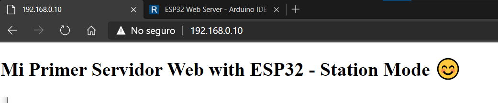
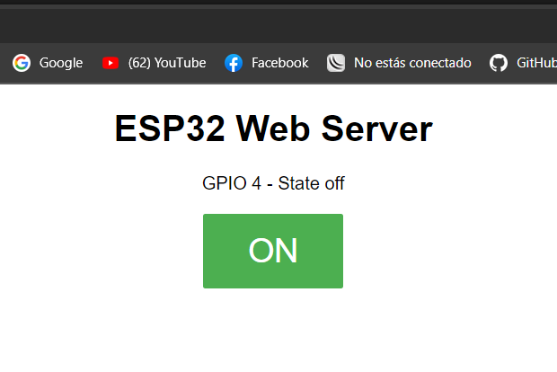
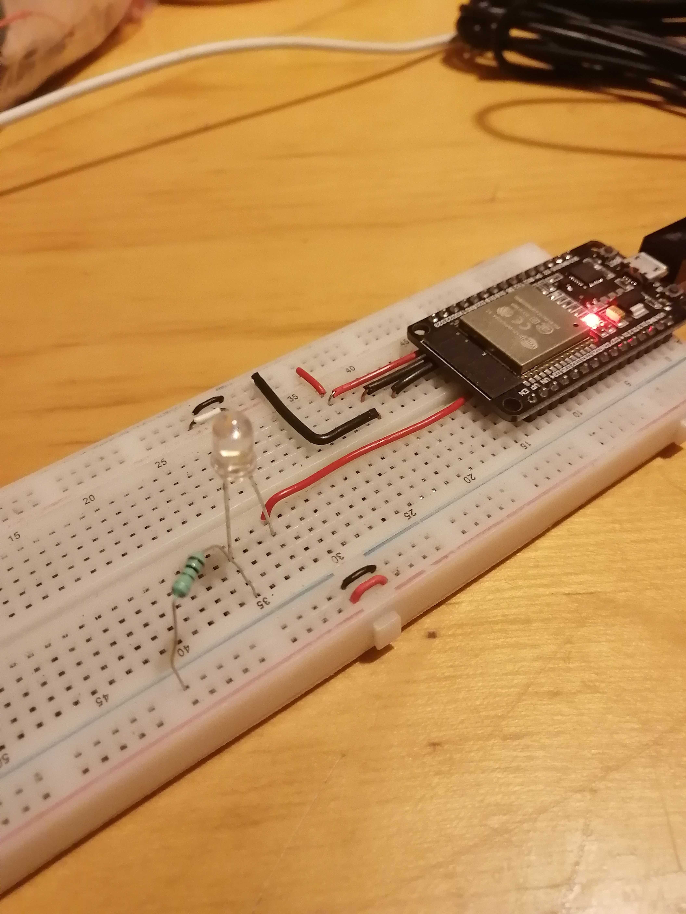
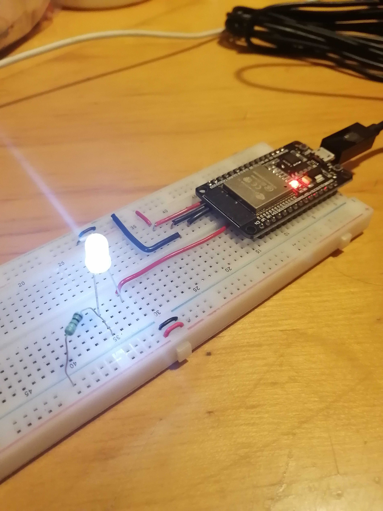

# :trophy: C4.2 Programación Microcontrolador NodeMCU ESP32

Comunicación por medio de la conexión Wi-Fi

___

## :blue_book: Instrucciones

- De acuerdo con la información presentada por el asesor referente al tema, desarrollar lo que se indica dentro del apartado siguiente.
- Toda actividad o reto se deberá realizar utilizando el estilo **MarkDown con extension .md** y el entorno de desarrollo VSCode, debiendo ser elaborado como un documento **single page**, es decir si el documento cuanta con imágenes, enlaces o cualquier documento externo debe ser accedido desde etiquetas y enlaces.
- Es requisito que el archivo .md contenga una etiqueta del enlace al repositorio de su documento en Github, por ejemplo **Enlace a mi GitHub**
- Al concluir el reto el reto se deberá subir a github el archivo .md creado.
- Desde el archivo **.md** se debe exportar un archivo **.pdf** con la nomenclatura **C4.2_NombreAlumno_Equipo.pdf**, el cual deberá subirse a classroom dentro de su apartado correspondiente, para que sirva como evidencia de su entrega; siendo esta plataforma **oficial** aquí se recibirá la calificación de su actividad por individual.
- Considerando que el archivo .pdf, fue obtenido desde archivo .md, ambos deben ser idénticos y mostrar el mismo contenido.
- Su repositorio ademas de que debe contar con un archivo **readme**.md dentro de su directorio raíz, con la información como datos del estudiante, equipo de trabajo, materia, carrera, datos del asesor, e incluso logotipo o imágenes, debe tener un apartado de contenidos o indice, los cuales realmente son ligas o **enlaces a sus documentos .md**, _evite utilizar texto_ para indicar enlaces internos o externo.
- Se propone una estructura tal como esta indicada abajo, sin embargo puede utilizarse cualquier otra que le apoye para organizar su repositorio.  


``` 
| readme.md
| | blog
| | | C4.1_TituloActividad.md
| | | C4.2_TituloActividad.md
| | | C4.3_TituloActividad.md
| | | C4.4_TituloActividad.md
| | | C4.5_TituloActividad.md
| | img
| | docs
| | | A4.1_TituloActividad.md
| | | A4.2_TituloActividad.md
```
___

## :pencil2: Desarrollo

1. Basado en el siguiente circuito, ensamblarlo, utilizando los elementos electrónicos observados.

<p align="center">
    
</p>

Fuente de consulta: [Random Nerd Tutorials]()

2. Analice y apóyese del programa que se muestra a continuación para elaborar el reto.

```C++
/*
 WiFi Web Server Simple
 */

#include <WiFi.h>
#include <WebServer.h>

const char* ssid = "<identificador>";
const char* password =  "<password>";

WebServer server(80);  // Object of WebServer(HTTP port, 80 is defult)

void setup() {
  Serial.begin(115200);
  Serial.println("Try Connecting to ");
  Serial.println(ssid);

  // Connect to your wi-fi modem
  WiFi.begin(ssid, password);

  // Check wi-fi is connected to wi-fi network
  while (WiFi.status() != WL_CONNECTED) {
  delay(1000);
  Serial.print(".");
  }
  Serial.println("");
  Serial.println("WiFi connected successfully");
  Serial.print("Got IP: ");
  Serial.println(WiFi.localIP());  //Show ESP32 IP on serial

  server.on("/", handle_root);

  server.begin();
  Serial.println("HTTP server started");
  delay(100); 
}

void loop() {
  server.handleClient();
}

// HTML & CSS contents which display on web server
String HTML = "<!DOCTYPE html>\
<html>\
<body>\
<h1>Mi Primer Servidor Web with ESP32 - Station Mode &#128522;</h1>\
</body>\
</html>";

// Handle root url (/)
void handle_root() {
  server.send(200, "text/html", HTML);
}
```

3. Pruebe y observe los resultados obtenidos explicándolos en esta sección.
  - Se observa que el esp32 se conceta a la red wifi indicada en el codigo y genera una pequeña pagina web en el puerto 80 del mismo, la cual solo tiene un letrero.

<p align="center">
  
</p>

<p align="center">
  
</p>


4. Al programa anterior agregue las instrucciones necesarias para que se despliegue en la interface un botón que permita encender y apagar un Led tal como se muestra en la figura 1.

5. Inserte aquí las imágenes que considere como evidencias para demostrar el resultado obtenido.

```C++
// Load Wi-Fi library
#include <WiFi.h>

// Replace with your network credentials
const char* ssid = "ARRIS-5162";
const char* password = "80523d60C46866@2";

// Set web server port number to 80
WiFiServer server(80);

// Variable to store the HTTP request
String header;

// Auxiliar variables to store the current output state

String output4State = "off";

// Assign output variables to GPIO pins

const int output4 = 4;

// Current time
unsigned long currentTime = millis();
// Previous time
unsigned long previousTime = 0; 
// Define timeout time in milliseconds (example: 2000ms = 2s)
const long timeoutTime = 2000;

void setup() {
  Serial.begin(115200);
  // Initialize the output variables as outputs
  pinMode(output4, OUTPUT);
  // Set outputs to LOW
  digitalWrite(output4, LOW);

  // Connect to Wi-Fi network with SSID and password
  Serial.print("Connecting to ");
  Serial.println(ssid);
  WiFi.begin(ssid, password);
  while (WiFi.status() != WL_CONNECTED) {
    delay(500);
    Serial.print(".");
  }
  // Print local IP address and start web server
  Serial.println("");
  Serial.println("WiFi connected.");
  Serial.println("IP address: ");
  Serial.println(WiFi.localIP());
  server.begin();
}

void loop(){
  WiFiClient client = server.available();   // Listen for incoming clients

  if (client) {                             // If a new client connects,
    currentTime = millis();
    previousTime = currentTime;
    Serial.println("New Client.");          // print a message out in the serial port
    String currentLine = "";                // make a String to hold incoming data from the client
    while (client.connected() && currentTime - previousTime <= timeoutTime) {  // loop while the client's connected
      currentTime = millis();
      if (client.available()) {             // if there's bytes to read from the client,
        char c = client.read();             // read a byte, then
        Serial.write(c);                    // print it out the serial monitor
        header += c;
        if (c == '\n') {                    // if the byte is a newline character
          // if the current line is blank, you got two newline characters in a row.
          // that's the end of the client HTTP request, so send a response:
          if (currentLine.length() == 0) {
            // HTTP headers always start with a response code (e.g. HTTP/1.1 200 OK)
            // and a content-type so the client knows what's coming, then a blank line:
            client.println("HTTP/1.1 200 OK");
            client.println("Content-type:text/html");
            client.println("Connection: close");
            client.println();
            
            // turns the GPIOs on and off
            if (header.indexOf("GET /4/on") >= 0) {
              Serial.println("GPIO 4 on");
              output4State = "on";
              digitalWrite(output4, HIGH);
            } else if (header.indexOf("GET /4/off") >= 0) {
              Serial.println("GPIO 4 off");
              output4State = "off";
              digitalWrite(output4, LOW);
            }
            
            // Display the HTML web page
            client.println("<!DOCTYPE html><html>");
            client.println("<head><meta name=\"viewport\" content=\"width=device-width, initial-scale=1\">");
            client.println("<link rel=\"icon\" href=\"data:,\">");
            // CSS to style the on/off buttons 
            // Feel free to change the background-color and font-size attributes to fit your preferences
            client.println("<style>html { font-family: Helvetica; display: inline-block; margin: 0px auto; text-align: center;}");
            client.println(".button { background-color: #4CAF50; border: none; color: white; padding: 16px 40px;");
            client.println("text-decoration: none; font-size: 30px; margin: 2px; cursor: pointer;}");
            client.println(".button2 {background-color: #555555;}</style></head>");
            
            // Web Page Heading
            client.println("<body><h1>ESP32 Web Server</h1>");
               
            // Display current state, and ON/OFF buttons for GPIO 4  
            client.println("<p>GPIO 4 - State " + output4State + "</p>");
            // If the output4State is off, it displays the ON button       
            if (output4State=="off") {
              client.println("<p><a href=\"/4/on\"><button class=\"button\">ON</button></a></p>");
            } else {
              client.println("<p><a href=\"/4/off\"><button class=\"button button2\">OFF</button></a></p>");
            }
            client.println("</body></html>");
            
            // The HTTP response ends with another blank line
            client.println();
            // Break out of the while loop
            break;
          } else { // if you got a newline, then clear currentLine
            currentLine = "";
          }
        } else if (c != '\r') {  // if you got anything else but a carriage return character,
          currentLine += c;      // add it to the end of the currentLine
        }
      }
    }
    // Clear the header variable
    header = "";
    // Close the connection
    client.stop();
    Serial.println("Client disconnected.");
    Serial.println("");
  }
}
```

<p align="center">
  
</p>

<p align="center">
  
</p>

<p align="center">
  
</p>

<p align="center">
  
</p>

___

### :bomb: Rubrica

| Criterios     | Descripción                                                                                  | Puntaje |
| ------------- | -------------------------------------------------------------------------------------------- | ------- |
| Instrucciones | Se cumple con cada uno de los puntos indicados dentro del apartado Instrucciones?            | 20 |
| Desarrollo    | Se respondió a cada uno de los puntos solicitados dentro del desarrollo de la actividad?     | 80      |

:house: [Inicio](/README.md)

[Enlace a mi GitHub](https://github.com/Abr06/Sistemas_Prog.git)