# :trophy: C5.2 Interface Node-RED y NodeMCU ESP32

Arquitectura Cliente-Servidor, utilizando interface Node-red, ESP32 y un actuador

---

## :blue_book: Instrucciones

- De acuerdo con la información presentada por el asesor referente al tema, desarrollar lo que se indica dentro del apartado siguiente.
- Toda actividad o reto se deberá realizar utilizando el estilo **MarkDown con extension .md** y el entorno de desarrollo VSCode, debiendo ser elaborado como un documento **single page**, es decir si el documento cuanta con imágenes, enlaces o cualquier documento externo debe ser accedido desde etiquetas y enlaces.
- Es requisito que el archivo .md contenga una etiqueta del enlace al repositorio de su documento en Github, por ejemplo **Enlace a mi GitHub**
- Al concluir el reto el reto se deberá subir a github el archivo .md creado.
- Desde el archivo **.md** se debe exportar un archivo **.pdf** con la nomenclatura **C5.2_NombreAlumno_Equipo.pdf**, el cual deberá subirse a classroom dentro de su apartado correspondiente, para que sirva como evidencia de su entrega; siendo esta plataforma **oficial** aquí se recibirá la calificación de su actividad por individual.
- Considerando que el archivo .pdf, fue obtenido desde archivo .md, ambos deben ser idénticos y mostrar el mismo contenido.
- Su repositorio ademas de que debe contar con un archivo **readme**.md dentro de su directorio raíz, con la información como datos del estudiante, equipo de trabajo, materia, carrera, datos del asesor, e incluso logotipo o imágenes, debe tener un apartado de contenidos o indice, los cuales realmente son ligas o **enlaces a sus documentos .md**, _evite utilizar texto_ para indicar enlaces internos o externo.
- Se propone una estructura tal como esta indicada abajo, sin embargo puede utilizarse cualquier otra que le apoye para organizar su repositorio.

```
| readme.md
| | blog
| | | C5.1_TituloActividad.md
| | | C5.2_TituloActividad.md
| | img
| | docs
| | | A5.1_TituloActividad.md
| | | A5.2_TituloActividad.md
```

---

## :pencil2: Desarrollo

1. Basado en las actividades referentes a actuadores, y protocolos de comunicación realice un Dashboard utilizando la interface Node-red y el NodeMCU ESP32; el cual permitirá a un cliente a través de su dispositivo movil acceder a una dirección de un servidor Web local, y al ingresar al sitio deberá poder interactuar y visualizar el comportamiento de un actuador en tiempo real.

2. Para poder observar que la interface muestra el comportamiento del actuador deberá a este someterse a condiciones cambiantes a fin de observar esas variaciones en la interface.

3. Agregue el programa creado para lograr la condición solicitada.

```C++

#include <WiFi.h>
#include <PubSubClient.h>
#include <Wire.h>
#include <Servo.h>
Servo myservo;

// Replace the next variables with your SSID/Password combination
const char* ssid = "REPLACE_WITH_YOUR_SSID";
const char* password = "REPLACE_WITH_YOUR_PASSWORD";

// Add your MQTT Broker IP address, example:
//const char* mqtt_server = "192.168.1.144";
const char* mqtt_server = "YOUR_MQTT_BROKER_IP_ADDRESS";

WiFiClient espClient;
PubSubClient client(espClient);
long lastMsg = 0;
char msg[50];
int value = 0;

void setup() {
  Serial.begin(115200);
  myservo.attach(13);
  setup_wifi();
  client.setServer(mqtt_server, 1883);
  client.setCallback(callback);
}

void setup_wifi() {
  delay(10);
  // We start by connecting to a WiFi network
  Serial.println();
  Serial.print("Connecting to ");
  Serial.println(ssid);

  WiFi.begin(ssid, password);

  while (WiFi.status() != WL_CONNECTED) {
    delay(500);
    Serial.print(".");
  }

  Serial.println("");
  Serial.println("WiFi connected");
  Serial.println("IP address: ");
  Serial.println(WiFi.localIP());
}

void callback(char* topic, byte* message, unsigned int length) {
  String movimiento;
  Serial.print("Message arrived [");
  Serial.print(topic);
  Serial.print("] ");

  for (int i = 0; i < length; i++) {
    Serial.print((char)message[i]);
    movimiento += (char)message[i];
  }

  if (String(topic) == "servo"){
    Serial.print("Changing output to ");
    int resultado = movimiento.toInt();
    int pos = map(resultado, 1, 100, 0, 180);
    Serial.println(pos);
    myservo.write(pos);
    delay(15);
  }
}

void reconnect() {
  // Loop until we're reconnected
  while (!client.connected()) {
    Serial.print("Attempting MQTT connection...");
    // Attempt to connect
    if (client.connect("ESP8266Client")) {
      Serial.println("connected");
      // Subscribe
      client.subscribe("servo");
    } else {
      Serial.print("failed, rc=");
      Serial.print(client.state());
      Serial.println(" try again in 5 seconds");
      // Wait 5 seconds before retrying
      delay(5000);
    }
  }
}
void loop() {
  if (!client.connected()) {
    reconnect();
  }
  client.loop();

  delay(100);
}

```

4. Agregue imágenes del circuito electrónico ensamblado.

<p align="center"> 
    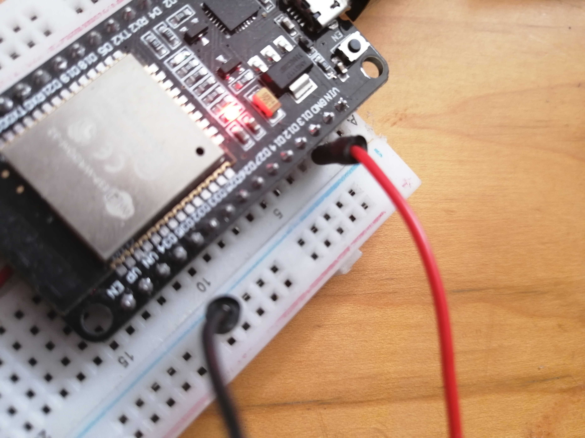
</p>

<p align="center"> 
    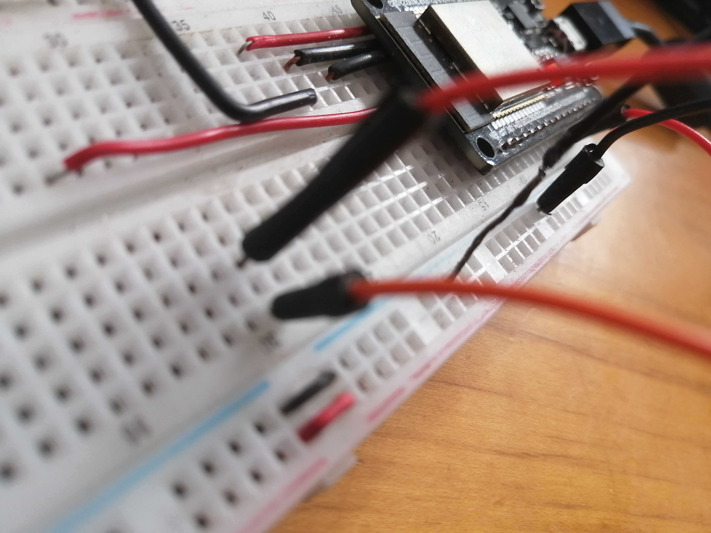
</p>

<p align="center"> 
    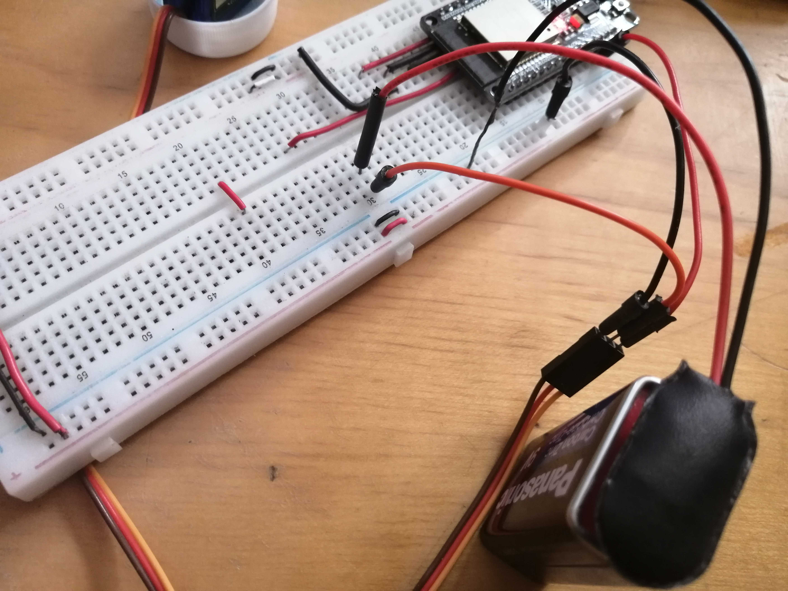
</p>

<p align="center"> 
    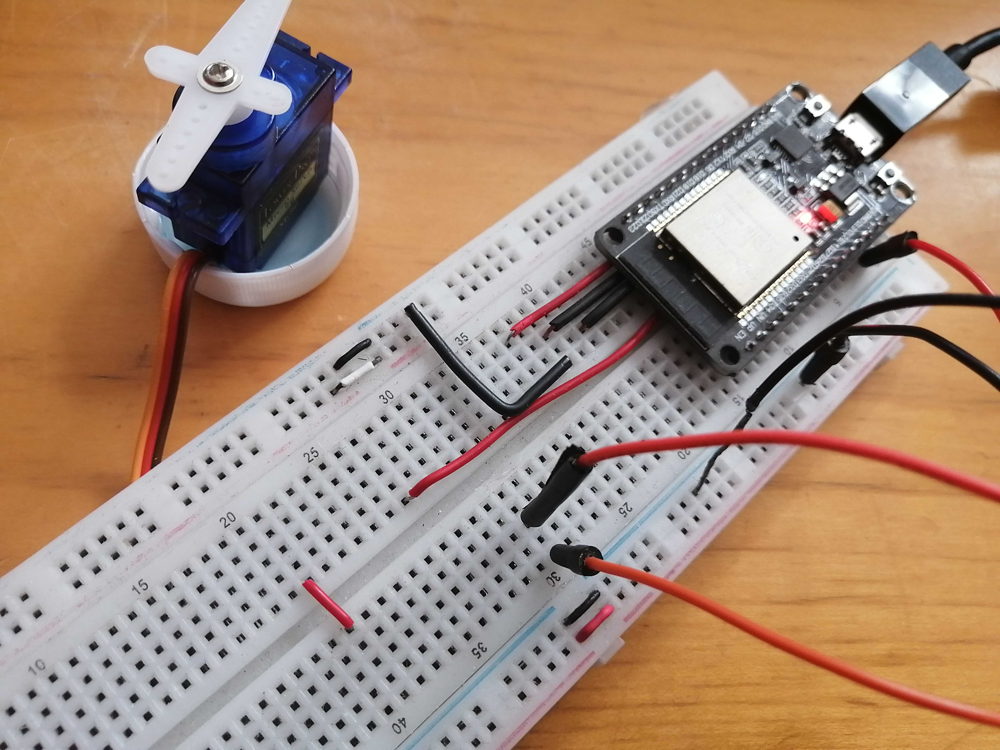
</p>

5. Inserte aquí las imágenes que considere como evidencias para demostrar el resultado obtenido y las reuniones del equipo de trabajo.

<p align="center"> 
    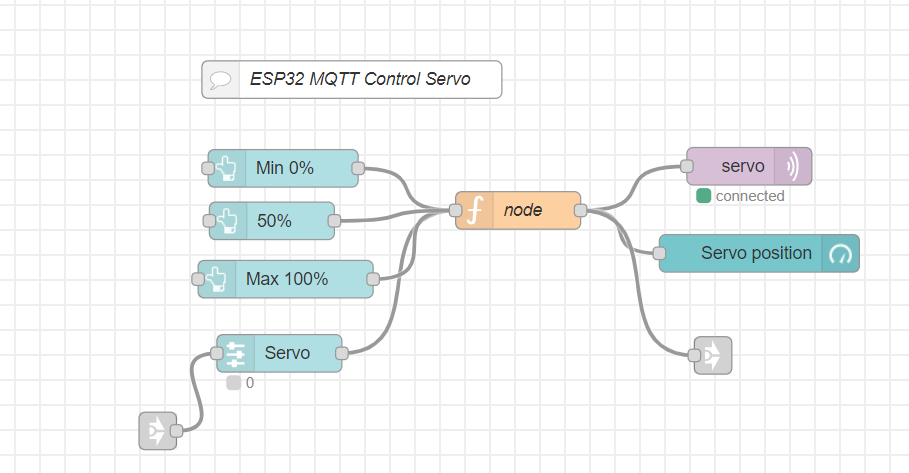
</p>

<p align="center"> 
    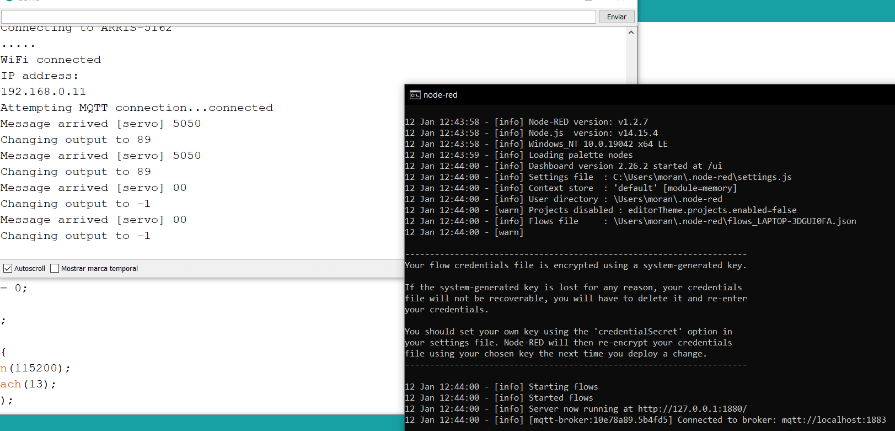
</p>

<p align="center"> 
    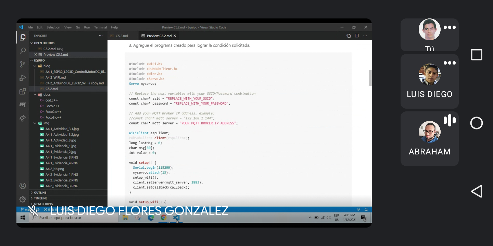
</p>

<p align="center"> 
    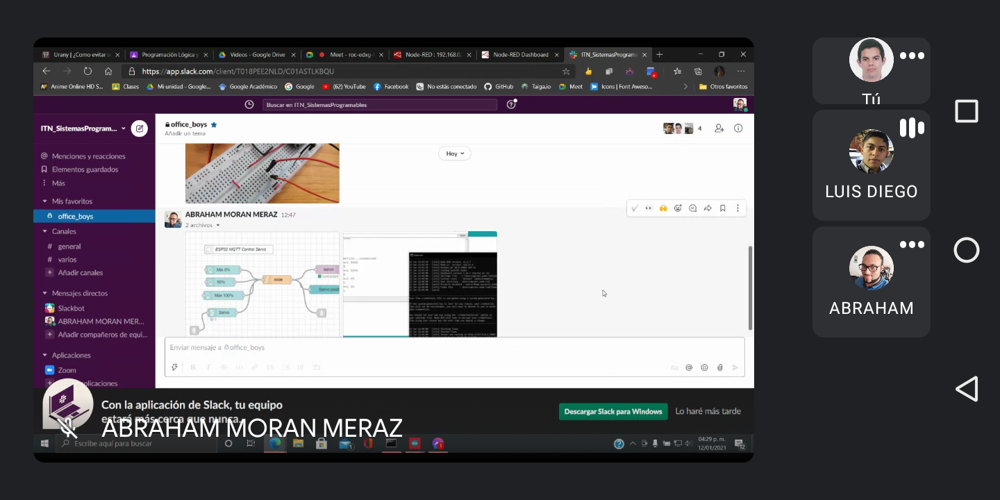
</p>

<p align="center"> 
    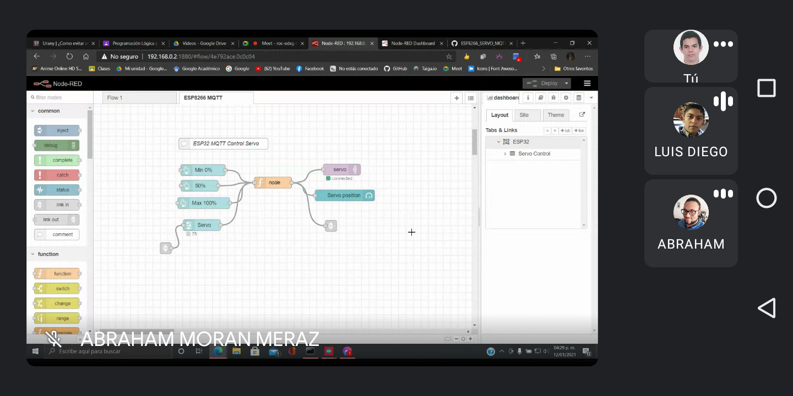
</p>

<p align="center"> 
    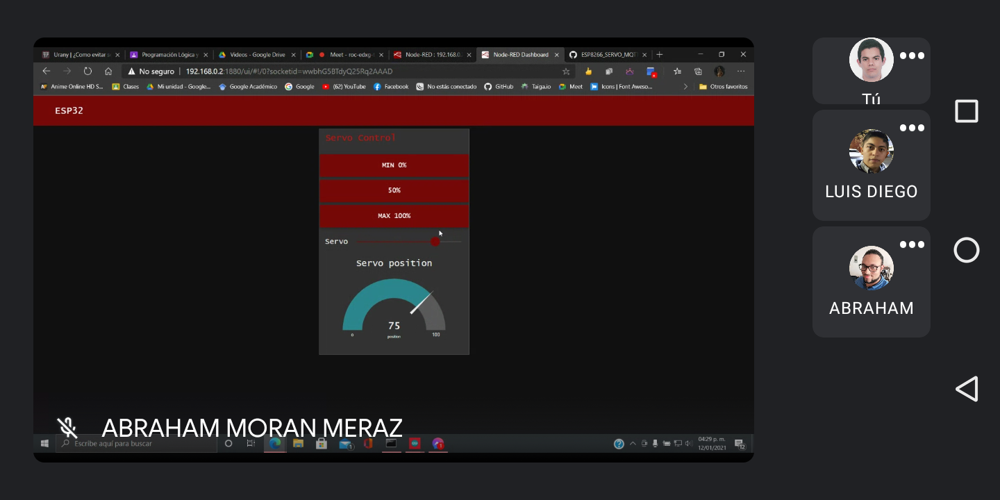
</p>

<p align="center"> 
    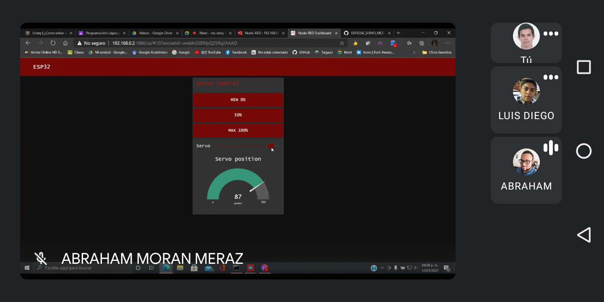
</p>

<p align="center"> 
    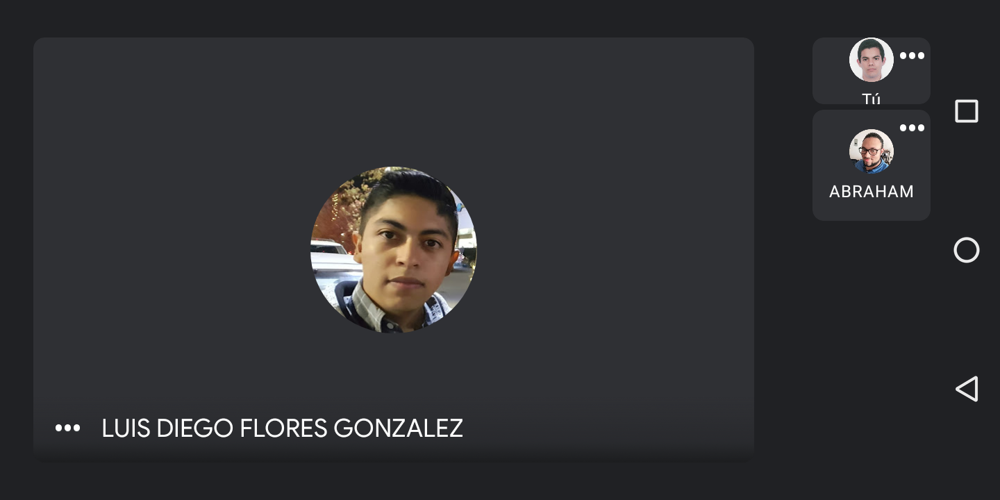
</p>

---

### :bomb: Rubrica

| Criterios     | Descripción                                                                              | Puntaje |
| ------------- | ---------------------------------------------------------------------------------------- | ------- |
| Instrucciones | Se cumple con cada uno de los puntos indicados dentro del apartado Instrucciones?        | 20      |
| Desarrollo    | Se respondió a cada uno de los puntos solicitados dentro del desarrollo de la actividad? | 80      |

# :open_file_folder: [>>>>>Enlace a mi GitHub: Diego Flores<<<<<](https://github.com/Diego-FloresG/Sistemas_Programables_Practicas) :open_file_folder:

# :open_file_folder: [>>>>>Enlace a mi GitHub: Abraham Moran<<<<<](https://github.com/AbrahamMoranMeraz/Sistemas_Prog) :open_file_folder:

# :open_file_folder: [>>>>>Enlace a mi GitHub: Eduardo Ruiz<<<<<](https://github.com/EduardoRuiz2099/Sistemas-Programables) :open_file_folder:
